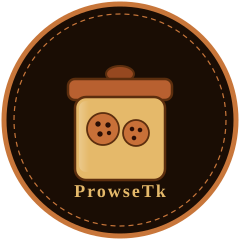

# ProwseTk



ProwseTk is an embeddable C++ toolkit for building programmable, headless web
browsers. It targets web scraping, endpoint discovery, API automation, testing,
and data-extraction workflows that need browser-like document and script
behavior without a graphical user interface.

ProwseTk does not depend on WebKit, Blink, or Gecko. It ships its own lightweight
engine, **Flatworm**, optimized for automation and programmability rather than
complete browser compatibility or pixel-perfect rendering.

An optional [FLTK desktop inspector](plugins/basic-gui/README.md) provides a
basic browser GUI for viewing the live page, DOM, source and activity. Its
graphical dependencies are confined to `plugins/basic-gui`; the core and
default build remain headless.

The separate [complex-gui](plugins/complex-gui/README.md) plugin paints the core
display-list renderer into a custom FLTK canvas. Its browser executable lives in
[`tools/prowse-gui`](tools/prowse-gui/README.md): navigation/history, scrolling,
hit-tested links and controls, masked form editing, and opt-in Session-mediated
PNG/JPEG images. Build with `cmake --preset complex-gui` and
`cmake --build --preset complex-gui`, then run
`build/complex-gui/tools/prowse-gui/prowse-gui --file tools/prowse-gui/example.html`.
`PROWSETK_BUILD_COMPLEX_GUI` defaults OFF and is independent of basic-gui.

Read the [ProwseTk Manual](manual/README.md) for 37 chapters covering installation,
the core APIs, Lua drivers/extensions, plugins, tools, and client interfaces.
It includes practical examples, configuration references, resource bounds, and
the current implementation's support levels, including Qutebrowser assistant
snapshots, Lua discovery, two-way marionettes, and the Booking API project.
Chapters 35–37 cover outbound CDP control, Cloudflare Browser Run, and OAuth
assistance with CLI authentication and private token caching.

## Table of Contents

- [Manual](manual/README.md)
- [Design Goals](#design-goals)
- [Architecture](#architecture)
- [Flatworm](#flatworm)
- [Parsing HTML and CSS](#parsing-html-and-css)
- [Public C++ API](#public-c-api)
- [Lua Control Layer (`lprowse`)](#lua-control-layer-lprowse)
- [Lua Extensions (`lprowsext`)](#lua-extensions-lprowsext)
- [Plugin System](#plugin-system)
- [WASM Runtime](#wasm-runtime)
- [Endpoint Extraction](#endpoint-extraction)
- [Web Interface](#web-interface)
- [JavaScript Execution](#javascript-execution)
- [Native Flatworm Modules](#native-flatworm-modules)
- [Asynchronous Operation](#asynchronous-operation)
- [Events and Hooks](#events-and-hooks)
- [Unsupported Web APIs](#unsupported-web-apis)
- [Diagnostics and Instrumentation](#diagnostics-and-instrumentation)
- [Security and Resource Limits](#security-and-resource-limits)
- [Project Configuration (`Prowse.toml`)](#project-configuration-prowsetoml)
- [Drivers](#drivers)
- [Automation Tools](#automation-tools)
- [Build and Runtime Strategy](#build-and-runtime-strategy)
- [Dependencies](#dependencies)
- [Compatibility Policy](#compatibility-policy)
- [Examples](#examples)
- [Non-Goals](#non-goals)
- [Repository Layout](#repository-layout)

## Design Goals

1. A small, embeddable C++ core.
2. Reliable headless navigation.
3. Lua-driven browser automation.
4. JavaScript execution through QuickJS.
5. A stable C/C++ plugin interface (`ProwseTk-Plugin.h`).
6. Lua-based extensibility.
7. Isolated browser sessions.
8. Deterministic automation behavior.
9. Detailed diagnostics and instrumentation.
10. Practical support for scraping and endpoint automation.
11. Minimal graphical and system dependencies.
12. Explicit documentation of browser compatibility.
13. A separate native module ABI for extending Flatworm's page JavaScript runtime.

## Architecture

ProwseTk uses a layered extension model. Each layer has a distinct
responsibility, and the WebAssembly runtime is an implementation detail hidden
behind an internal interface.

```text
ProwseTk core
    |
    +-- Native C/C++ plugins through ProwseTk-Plugin.h
    |
    +-- Flatworm page-runtime modules through Flatwork-Module.h
    |
    +-- Lua drivers and extensions through lprowse / lprowsext / lprowseir
    |
    +-- WASM modules/components through a capability-limited host
```

Four execution environments participate in a session:

- **C++** hosts ProwseTk, implements the core engine, and supplies native
  Flatworm page-runtime modules.
- **Lua** drives browser sessions and provides lightweight scripting extensions.
- **WASM** provides portable, sandboxed plugins for heavier or untrusted
  extensions.
- **JavaScript** remains the page scripting runtime inside Flatworm.

### Extension layers at a glance

```text
                         ProwseTk Host
                              |
                    +---------+---------+
                    |                   |
              Native plugins       Flatworm
          ProwseTk-Plugin.h        browser engine
                    |                   |
                    +---------+---------+
                              |
                  WASM runtime abstraction
                         Wasmtime
                              |
                    WASM plugin components
                              |
              +---------------+---------------+
              |                               |
        ProwseTk-WASM SDK                 WASI capabilities
        guest-side APIs                   filesystem, clocks,
                                          sockets, randomness
```

Native plugins can load WASM components, register them with the host, and expose
them through ProwseTk. Lua scripts never receive unrestricted access to the
underlying Wasmtime objects; they interact with managed handles only.

## Flatworm

Flatworm is ProwseTk's headless browser engine. It provides the core
functionality required to load, inspect, and interact with web documents.

Flatworm is not a complete replacement for a general-purpose browser engine. It
focuses on behavior useful to automation applications:

- HTTP and HTTPS navigation
- Redirect handling
- URL resolution and normalization
- HTML parsing
- DOM construction and traversal
- Element selection and manipulation
- Form inspection and submission
- Cookies and request headers
- JavaScript execution
- Basic browser storage
- Network request interception
- Resource discovery
- Event-driven navigation
- Script and network diagnostics
- Plugin and extension integration

Flatworm implements standards-based behavior where required by supported
workflows. Features that are not useful for headless automation may be omitted,
simplified, or represented by configurable dummy implementations.

Flatworm does not require:

- A display server
- A windowing system
- GPU acceleration
- A graphical desktop environment
- A complete CSS layout engine
- Pixel rendering
- A full browser user interface

## Parsing HTML and CSS

ProwseTk parses page HTML into Flatworm's DOM (Document Object Model), enabling
JavaScript evaluation and document processing. `BrowserConfig::html_parser`
defaults to **Flatworm's built-in tolerant parser**, a dependency-free
implementation of the `Document`/`Element`/CSS-selector slice. Optional `lexbor`
and `gumbo-parser` backends copy their parsed trees into that shared DOM model;
`HtmlParser::Auto` prefers Lexbor, then Gumbo, then the built-in parser. NetSurf's
`libdom` remains a declared dependency rather than the current DOM owner.

The built-in parser keeps the engine usable without a third-party HTML
toolchain. Selector support covers type, class, id,
attribute operators, the descendant/child/adjacent/general-sibling combinators,
selector lists, Unicode CSS escapes, explicit ASCII case-insensitive (`i`) and
case-sensitive (`s`) attribute flags, and structural child/of-type pseudo-classes
(including reverse `nth` variants), `:empty`, `:root`, and `:not()` with nested
complex selector lists. Unflagged attribute values remain case-sensitive;
HTML enumerated-attribute case folding is not implemented. Unsupported syntax
(including `:is()`, `:where()`, `:has()`, namespaces, and pseudo-elements) fails
explicitly instead of returning misleading matches.

Selector processing has separate internal layers: `selector_model.hpp` holds
syntax data, `selector_parser.cpp` validates and decodes it without accessing
the DOM, `selector_matcher.cpp` evaluates it without reparsing, and
`css_selector.cpp` performs iterative preorder traversal. First-match queries
stop immediately; element queries exclude the receiver and preserve document
order without duplicate results. C++, Lua, and page JavaScript share this path.
Selectors are limited to 64 KiB, 256 total compounds, and 32 nested negations
(`ParseError`); matching is limited to 100,000 compound evaluations per candidate
(`ResourceLimit`). These limits bound recursion and combinatorial backtracking;
they do not claim a wall-clock deadline or full CSS conformance.


Flatworm HTML processing separates value-only syntax records (`html_model.hpp`),
streaming tokenization (`html_tokenizer.cpp`),
character references (`html_entities.cpp`), shared syntax vocabulary
(`html_syntax.cpp`), tree construction (`html_parser.cpp`), node ownership and
mutation (`dom_node.cpp`), and HTML encoding (`html_serializer.cpp`). The
same parser serves document loads and DOM fragments across C++, Lua, and page
JavaScript. It keeps the first duplicate attribute, accepts punctuation in
attribute names, requires a delimited matching raw-text/RCDATA end tag, and
ignores the trailing solidus on non-void HTML start tags. Numeric references
support optional semicolons, invalid-scalar replacement, and HTML C1 remapping;
named references remain restricted to the documented source vocabulary with
required semicolons. Scoped omitted-end-tag recovery covers paragraphs, list
items, definition items, options/groups, and table cells/rows/sections.

Parsing fails with `ErrorCode::ResourceLimit` above 16 MiB of input, 250,000
total nodes (including the document node), or 256 node levels below the document.
These bounds apply to each parse, including fragments; they are not a cumulative
quota on later DOM mutations. The parser remains a restricted tolerant HTML
parser: no implicit html/head/body or table wrappers, foster parenting,
adoption-agency reconstruction, foreign-content namespaces, full named-entity
vocabulary, input encoding sniffing, or context-sensitive fragment insertion
modes. This expansion does not imply full HTML5 conformance.

An XPath interface into the DOM is exposed through the Lua extension layer as
`lprowsext.dom.xpath`. XPath substantially increases scraping reach compared with
plain CSS selectors.

When the vendored QuickJS-NG source is available, the core provides a
persistent page-context JavaScript runtime with string globals, exception
reporting, per-evaluation memory limits, and interrupt-based execution
deadlines. Flatworm installs a host-mediated web-platform shim over that
runtime for page scripting, including `document`, timers, `location`,
`fetch`, `XMLHttpRequest`, storage, cookies, `URL`, and `navigator`.
The default browser identity is a configurable, Chrome-like Linux user agent
and navigator surface so JavaScript-gated pages can progress far enough for
automation, while capability queries still describe the implementation
honestly rather than claiming full browser compatibility.

## Public C++ API

### Explicit headless display lists

`#include <prowsetk/render.hpp>` exposes `render_document`, computed styles,
text measurement, image caching, and `hit_test`. A render is an explicit snapshot:
it returns ordered background, border, text, marker, image, and control records
in CSS-pixel document coordinates. It requires neither FLTK nor a display server.
The host paints the records and routes a hit's interactive element through the
existing Session interaction APIs. Rerender after DOM changes or viewport changes;
old display lists retain element handles and must not be used for later actions.

```cpp
prowsetk::RenderOptions options;
options.viewport_width = 800;
auto page = prowsetk::render_document(*document, options);
auto hit = prowsetk::hit_test(page.paint, 20, 40);
```

The supported subset is normal block/inline flow, atomic inline boxes, explicit
width/height and min/max sizes, margins/padding/borders, relative left/top offsets,
text wrapping, visibility, ancestor clipping, list markers, and form-control
records. The cascade reads embedded styles and inline declarations, with
importance, specificity, source order, and inherited text properties. External
stylesheets are not fetched. Unrecognized selectors and properties are ignored.
Table boxes currently use block-flow fallback; flex/grid, floats, absolute
positioning, stacking contexts, text shaping, full inline box decoration, and
browser-conformant table layout are unsupported. Percentage margins/padding use
the viewport width. The default measurer approximates UTF-8 advances; consumers
can supply a `TextMeasurer`. This API does not change page-JavaScript geometry or
canvas support, or replace the GUI's existing sanitized ProwseEvent preview.

Image loading is opt-in through a caller-owned `ImageLoader` and `ImageCache`.
The host must apply its Session network policy and bound response bytes. The
engine opens no sockets. Optional stb decodes PNG/JPEG bytes; absent decoding or
loading yields an image record with alt text and `degraded=true`. Images use
explicit CSS dimensions or an alt-text-sized fallback, not intrinsic sizing.
Control values are redacted in display records; other DOM text is caller data,
so display lists are local presentation objects, not sanitized exports.

Bounds include 40,000 elements, 256 node levels, 16 MiB of text/attributes, 4 MiB of
stylesheet text, 40,000 rules/declarations, two million cascade candidate checks,
400,000 paint items, and an 8 MiB/256-entry image cache. Invalid render dimensions
throw `InvalidArgument`; document/style/line limits throw `ResourceLimit`.
Paint/image truncation sets `RenderedPage::limited`. Loader exceptions propagate.
No plugin ABI or WIT contract changes are required.

The public C++ API separates browser responsibilities into focused components.
All components are replaceable or extendable through documented interfaces.

### `Browser`

Owns global configuration and creates browser sessions.

- Engine configuration
- Network configuration
- Plugin loading
- Lua runtime configuration
- Logging configuration
- Global resource limits
- Session creation and destruction

### `Session`

Represents an isolated browsing context.

A session may contain its own:

- Current URL
- Cookies
- Local storage
- Session storage
- JavaScript state
- Request headers
- Proxy settings
- Navigation history
- Plugin state
- Security policy
- Timeout configuration

Multiple sessions run independently within the same browser instance.

### `Document`

Represents the currently loaded HTML document.

- Title access
- URL and base URL access
- Text extraction
- CSS selector queries
- Element lookup
- Metadata inspection
- Link and form discovery
- Script and resource discovery
- DOM traversal

### `Element`

Represents a DOM element or node.

- Tag-name access
- Attribute access
- Text and HTML extraction
- Child and parent traversal
- CSS selector queries
- Form values
- DOM mutation
- Visibility or availability metadata where applicable

### `NetworkClient`

Performs HTTP and HTTPS requests.

- Request construction
- Response processing
- Redirect handling
- Cookie integration
- Header management
- Connection reuse
- Timeouts
- Proxy support
- TLS configuration
- Request interception
- Response interception
- Download limits
- Compression handling

Navigation applies valid `Set-Cookie` response headers before following a
redirect or issuing the next request. Cookie scope is enforced by scheme,
domain, and RFC-style path boundaries; replacement and expiration use the
cookie name/domain/path identity.

The POSIX socket transport supports HTTPS when OpenSSL 3 is found at configure
time. It verifies the certificate chain and hostname, sends SNI, and requires
TLS 1.2 or newer. OpenSSL's default CA paths (including `SSL_CERT_FILE` and
`SSL_CERT_DIR`) select the trust store; there is no insecure verification
override. Without OpenSSL, HTTP remains available and HTTPS fails explicitly.
Use `OPENSSL_ROOT_DIR` to select a separately installed copy of the vendored
OpenSSL submodule, or `CMAKE_DISABLE_FIND_PACKAGE_OpenSSL=ON` for an HTTP-only
build.

### `JavaScriptRuntime`

Provides JavaScript execution through QuickJS.

- Script evaluation
- Execution limits
- Memory limits
- Exception reporting
- Console event forwarding
- Host-object bindings
- Promise and timer integration
- Page-context isolation
- Native page-runtime module installation and bounded ECMAScript module evaluation

### `LuaRuntime`

Provides Lua execution for automation and extensions.

- Loading Lua scripts
- Calling Lua functions from C++
- Exposing browser objects to Lua
- Registering Lua event handlers
- Loading Lua extensions
- Runtime limits
- Error propagation
- Per-session or shared Lua state

### `WebPlatform`

Provides browser-compatible Web API bindings. Every API carries an
implementation classification (see [Compatibility Policy](#compatibility-policy));
the classification is available in documentation and through a runtime
capability query.

### `Storage`

Provides storage backends for:

- Cookies
- Local storage
- Session storage
- Cache data
- Application-defined persistence

The default in-memory cookie jar supports host-only and domain cookies,
`Secure`, `HttpOnly`, `SameSite`, `Max-Age`, and common HTTP-date `Expires`
attributes. Invalid or out-of-scope response cookies are ignored, and cookie
changes are reported through `EventType::CookieChange`.

Storage is replaceable through C++ interfaces.

### `EventDispatcher`

Delivers events related to:

- Navigation
- Requests
- Responses
- Redirects
- Document loading
- DOM changes
- JavaScript execution
- JavaScript exceptions
- Console output
- Unsupported APIs
- Plugin lifecycle
- Session lifecycle

### `EmbeddedBrowser`

`EmbeddedBrowser` is the compact ownership API for host applications. It owns a
`Browser` and one isolated `Session`, provides `load_html` and `navigate`, and
streams the loaded document through the canonical `ProwseEvent` IR. Returning
`EventStreamControl::Stop` stops delivery without invalidating the document;
an empty visitor and an unloaded document report normal `Error` codes.

```cpp
#include <prowsetk/embedding.hpp>

prowsetk::EmbeddedBrowser browser;
browser.load_html("<p>Hello</p>");
browser.stream_events([](const prowsetk::ProwseEvent& event) {
    // consume start / attribute / text / end records
    return prowsetk::EventStreamControl::Continue;
});
```

## Lua Control Layer (`lprowse`)

ProwseTk uses Lua as its primary scripting and automation language.
`lprowse` is the primary programmable browser API. Applications use it to
control browser sessions, navigate pages, inspect documents, execute JavaScript,
process results, and coordinate multiple sessions.

```lua
local prowse = require("lprowse")

local browser = prowse.browser.new()
local session = browser:create_session()

session:navigate("https://example.com")

local document = session:document()

print(document:title())

for _, link in ipairs(document:query_selector_all("a")) do
    print(link:attribute("href"))
end
```

`lprowse` exposes:

- Browser creation
- Session management
- Navigation
- HTTP requests
- Document access
- CSS selector queries
- Element inspection
- Form interaction
- Cookie management
- Storage access
- JavaScript evaluation
- Event subscriptions
- Request and response hooks
- Logging and diagnostics
- Capability queries
- Plugin management

Session headers can be inspected or reset with `session:headers()` and
`session:clear_headers()`. Documents additionally expose forms, scripts,
resource URLs, tag-name queries, the root element, and detached-element
creation. Elements expose attribute tables, sibling traversal, and managed DOM
mutation (`append_child`, `remove_child`, and `set_text`). These APIs retain
the normal session event and lifetime rules; Lua never owns the underlying C++
objects.

Lua scripts may be loaded from files, passed as strings, or embedded directly
into C++ applications. Collected session and extractor userdata invalidate their
callbacks and release their shared lifetime guards; runtime teardown removes
the corresponding event subscriptions.

## Lua Extensions (`lprowsext`)

`lprowsext` and its submodules extend ProwseTk itself. Lua extensions may:

- Register new browser commands
- Add document extraction helpers
- Define reusable navigation workflows
- Subscribe to browser events
- Modify or reject requests
- Inspect and transform responses
- Add custom output formats
- Register endpoint detectors
- Provide domain-specific automation APIs
- Coordinate multiple browser sessions
- Define custom diagnostics
- Compose existing C++ plugins

```lua
local prowse = require("lprowse")
local ext = require("lprowsext")

local extractor = ext.extractor.new()

extractor:on_document(function(document)
    return {
        title = document:title(),
        links = document:query_selector_all("a")
    }
end)

local browser = prowse.browser.new()
browser:install_extension(extractor)

local session = browser:create_session()
session:navigate("https://example.com")
```

`lprowsext.register_document_processor(name, callback)` registers a processor
for explicit calls to `lprowsext.process_document(document)`. Each processor
receives the supplied document; the returned table contains successful results
keyed by processor name. Nil results and failed callbacks are omitted, while
false, numeric, string, and table results are retained. An empty registry returns
an empty table. Registration alone does not subscribe to navigation events;
use an installed extractor for automatic document callbacks.

Lua extensions expose both synchronous and asynchronous behavior. They may use
the engine's event loop, timers, request hooks, and session lifecycle events.

## Plugin System

[`plugins/browser-run-integration`](plugins/browser-run-integration/README.md)
adds an explicit Cloudflare Browser Run client: authenticated remote CDP
connections, Quick Actions HTML fetching, and snapshot import into a
JavaScript-disabled Flatworm Session for existing queries/extractors. The core
outbound `CdpClient` complements the existing inbound CDP server, with bounded
RFC 6455 WebSocket transport through `NetworkClient`. Remote page networking
runs in Cloudflare, outside local Session hooks. Use `CLOUDFLARE_ACCOUNT_ID` /
`CLOUDFLARE_API_TOKEN` or `[cloudflare].account_id` / `api_token` in `Prowse.toml`.
`ptk-browser-run` exposes `content` and single-command `cdp` operations; persistent
C++ clients support multi-command marionettes. See the plugin guide for limits
and the existing Flatworm CDP compatibility restrictions.

[`plugins/oauth-assist`](plugins/oauth-assist/README.md) provides
`ptk-oauth-assist login|refresh|status|logout`, explicit OAuth 2.0 authorization
code/PKCE, and a private cache at `$HOME/.cache/ProwseTk/OAuth/token.json`.
`[oauth]` configures the registered public client, scopes, endpoints and redirect
URI; `PROWSETK_OAUTH_CLIENT_ID` / `PROWSETK_OAUTH_SCOPES` override those fields.
Login uses a browser authorization URL and hidden-input manual redirect handoff.
The existing `third_party/liboauthpp` is an OAuth 1.0a library; its encoding
helper is reused, while OAuth 2.0 is implemented separately with OpenSSL and
host HTTP. Cloudflare client registration/scopes must be supplied by the host;
no Wrangler identity is borrowed and no OAuth grant is assumed to authorize
Browser Run. Both native ABI-v2 facades load without network activity.

The repository includes `plugins/basic-gui`, an optional FLTK browser inspector.
`ptk-basic-gui` supplies URL navigation/history, a basic HTML page preview,
DOM/attribute inspection, sanitized source, console/network activity, synthetic
clicks/typing, explicit page-JavaScript evaluation and Lua-configured OpenCode
marionette runs. Its OpenCode tab checks a server and requests advisory replies
through `opencode-bridge` using structural page context; both tabs share the
server override and keep agent authentication separate from page networking.
The Marionette tab loads trusted Lua `main(args)` scripts that
return bounded action policies; OpenCode chooses permitted action IDs on the
displayed Session. See the plugin guide for connection setup and script examples.
It uses the owning Flatworm Session; every network request retains host policies, cookies and
hooks. Preview links carry revision/node action IDs, and FLTK never loads page
resource files or external URIs. Loading the ABI-v2 facade is display/network-free;
the C++ `Viewer` explicitly opens a window. The `Controller` and snapshot model
work without a display. Enable the desktop adapter with `PROWSETK_BUILD_BASIC_GUI=ON`
or the `gui` preset, then start it with `tools/launch-gui.sh --url URL` or
`tools/launch-gui.sh --file PAGE.html`. See
[the plugin guide](plugins/basic-gui/README.md) for
embedding, supported preview markup, redaction and bounds.

The repository includes `plugins/ai-oracle`, an optional OpenAI Responses API
oracle built with `third_party/openaipp`. C++ helpers, an opaque C service API,
and the callable `ai_oracle` Lua module provide bounded text/image inquiries for
CAPTCHA assistance and structured crawl recommendations. Each client requires
explicit enablement and a key; requests go through the host NetworkClient with
timeouts, input/output/token limits, and a finite attempt budget. Page snapshots
and structured context receive default redaction, and results retain advisory
provenance. See `plugins/ai-oracle/README.md` for configuration, composition,
Lua module loading, and supported behavior.

The repository includes `plugins/spider`: `ptkspiderd` supervises persistent,
named Flatworm crawler workers and `ptkspiderctl` controls their sessions,
synthetic clicks/typing, Lua drivers and queryable LMDB caches. `lspider` binds
drivers to an existing spider session. Durable breadth-first frontiers,
same-origin transport enforcement, bounded robots-aware crawling, retries,
scheduled recrawls, process watchdogs and paused restart recovery support
long-running operation. The plugin requires Linux, LMDB and `lmdbxx`; its native
ABI remains version 2. See `plugins/spider/README.md` for commands, resource
limits, redaction and recovery semantics.

The repository includes `plugins/beacon`, a Firefox Native Messaging bridge
for user-approved inspection of a connected tab. A local `beacond` broker
tracks bounded Flash sessions, `beaconctl` registers and polls Flashes from
driver processes, and the Firefox addon sends page HTML, styles, limited
network request metadata, or selector-scoped DOM mutation notifications after
the user connects. The owner-only Unix socket is a same-user trust boundary;
page content can contain secrets. See `plugins/beacon/README.md` for setup,
protocol, and current limitations.

The repository includes `plugins/ezlogin`, a native host-mediated
authentication plugin. It supports Basic, Bearer, API-key, and custom-header
request credentials without exposing secrets to plugin logs. Form-based login
is handled by the shipped `drivers/login.lua`; once that session is
authenticated, scrapers can be activated with the same session. See
`plugins/ezlogin/README.md` for configuration.

The core includes an `AntiBotDetector` subsystem that inspects HTTP responses
and parsed documents for heuristic anti-bot and CAPTCHA challenge signals. It
emits `anti_bot_detected` events with provenance signals and confidence; results
are advisory, not authoritative.

The repository also includes `plugins/captcha-handler`, a native plugin built
on the detector. It exposes eight host-mediated handling methods: manual user
prompt, external solver API, webhook dispatch, Lua callback, pre-solved token,
cookie/session reuse, wait-for-clearance, and abort-and-report. Methods that
could expose secrets or call external services are unavailable until explicitly
configured by the host.

The repository also includes `plugins/restful-resolver`, a native plugin that
resolves scraped endpoints iteratively through the owning session until a full
RESTful surface is discovered: at least one GET and at least one POST
endpoint. Seeds come from static discovery (links, POST forms,
`fetch`/`XMLHttpRequest` methods); each round probes API-like URLs through the
host-mediated `NetworkClient`, follows JSON references, and re-parses HTML
bodies so POST forms and script POST calls in resolved pages are found. The
loop stops on GET+POST completeness or when `max_rounds` / `max_requests` is
exhausted, and emits deterministic OpenAPI 3.x YAML with an
`x-prowsetk-restful` extension (`has-get`, `has-post`, `is-complete`,
`rounds-used`, `request-count`). Discovery is heuristic and never
authoritative; secrets stay redacted. See
`plugins/restful-resolver/README.md` for options. The
`examples/booking-dotcom-admin-scrape` driver applies it after its crawl and
records the outcome in the same `x-prowsetk-restful` block.

The repository also includes `plugins/schema-grabber`, a native plugin that
reverse-engineers scraped endpoints into full request/response schemas plus
URL parameters. It composes with `plugins/scrape-endpoints`: scrape first for
discovery, then enrich the same endpoints so the exported OpenAPI and Postman
specs carry typed query/path parameters, request bodies, and response
schemas. Query parameters are typed from example values; volatile path
segments become `{id}`-style templates; POST/PUT/PATCH request schemas come
from matching form fields first, then JSON body hints in inline scripts;
response schemas come from observed bytes — bounded host-mediated GET probes
for GET endpoints, or bodies resolved alongside `scrape-endpoints` — parsed
with a dependency-free JSON inferrer. POST/PUT/PATCH endpoints are never
probed with their own method. Output is deterministic OpenAPI 3.x YAML with
an `x-prowsetk-schema` extension (request/response provenance) and Postman
2.1 JSON with query pairs, `:var` path variables, and example bodies.
Inference is heuristic and never authoritative; secrets stay redacted. See
`plugins/schema-grabber/README.md` for options. The WIT contract for a future
WASM component lives in `wit/schema-grabber.wit`; the Lua spec layer is
`plugins/schema-grabber/lua/schema_grabber.lua` (`enrich(session, spec)`).

The repository also includes `plugins/opencode-bridge`, a native plugin that
bridges Flatworm sessions and an OpenCode local HTTP/SSE agent server
(default `http://127.0.0.1:4096`). It sends sanitized DOM snapshots with
extraction goals to agent sessions, validates JSON-object answers, and exposes
the `lopencode` Lua module (`client.new`, `prompt`, `prompt_async`,
`stream_events`, `scrape_with_prompt`, `build_cleanup_prompt`). It also builds
subtractive endpoint-cleanup prompts over redacted endpoint lists; callers
intersect the answer with the scraped set so invented URLs can never enter the
specs. All traffic is host-mediated through `NetworkClient` with Basic
credentials from `OPENCODE_SERVER_USERNAME` / `OPENCODE_SERVER_PASSWORD`;
plain HTTP is loopback-only unless opted in, redirects are rejected, payloads
are bounded, and agent output stays advisory. See
`plugins/opencode-bridge/README.md` for configuration.

ProwseTk provides a native plugin interface through `ProwseTk-Plugin.h`. The
interface allows native components to extend the browser without modifying the
Flatworm core.

Plugins may provide:

- Request and response handlers
- Custom resource loaders
- DOM processors
- Document extractors
- Lua modules
- Lua extension functions
- Storage backends
- Authentication handlers
- Cookie policies
- Event listeners
- Output generators
- Capability providers
- Diagnostics and instrumentation
- Custom automation commands

Native page-runtime bindings have their own engine-owned interface,
[`Flatwork-Module.h`](include/Flatwork-Module.h), described under
[Native Flatworm Modules](#native-flatworm-modules).

### Native plugin ABI

`ProwseTk-Plugin.h` is the native plugin entry point. It uses a C-compatible ABI
so plugins remain binary-compatible across supported C++ compilers and standard
libraries.

```c
#ifndef PROWSETK_PLUGIN_H
#define PROWSETK_PLUGIN_H

#include <stddef.h>
#include <stdint.h>

#ifdef __cplusplus
extern "C" {
#endif

#define PROWSETK_PLUGIN_ABI_VERSION 2

/* Exported entry-point symbol: a shared object defines
 *   const ProwseTkPlugin* prowsetk_plugin_entry(void);
 */
#define PROWSETK_PLUGIN_ENTRY_SYMBOL "prowsetk_plugin_entry"

#if defined(_WIN32)
#define PROWSETK_PLUGIN_EXPORT __declspec(dllexport)
#else
#define PROWSETK_PLUGIN_EXPORT __attribute__((visibility("default")))
#endif

typedef struct ProwseTkHost ProwseTkHost;

typedef enum {
    PROWSETK_STATUS_OK = 0,
    PROWSETK_STATUS_ERROR = 1,
    PROWSETK_STATUS_INVALID_ARGUMENT = 2,
    PROWSETK_STATUS_SECURITY_VIOLATION = 3
} ProwseTkStatus;

typedef enum {
    PROWSETK_PLUGIN_NATIVE = 1,
    PROWSETK_PLUGIN_LUA = 2,
    PROWSETK_PLUGIN_WASM = 3
} ProwseTkPluginType;

typedef enum {
    PROWSETK_LOG_TRACE = 0,
    PROWSETK_LOG_DEBUG = 1,
    PROWSETK_LOG_INFO = 2,
    PROWSETK_LOG_WARN = 3,
    PROWSETK_LOG_ERROR = 4
} ProwseTkLogLevel;

typedef enum {
    PROWSETK_HOOK_CONTINUE = 0,
    PROWSETK_HOOK_REJECT = 1,
    PROWSETK_HOOK_REPLACE_REQUEST = 2
} ProwseTkHookAction;

typedef struct {
    const char* name;
    const char* value;
} ProwseTkHeader;

typedef struct {
    const char* data;
    size_t size;
} ProwseTkBytes;

typedef struct {
    const char* method;
    const char* url;
    const ProwseTkHeader* headers;
    size_t header_count;
    ProwseTkBytes body;
    uint32_t timeout_ms;
    size_t max_response_bytes;
} ProwseTkHttpRequest;

typedef struct {
    uint16_t status;
    const ProwseTkHeader* headers;
    size_t header_count;
    ProwseTkBytes body;
    const char* final_url;
} ProwseTkHttpResponse;

typedef struct {
    ProwseTkHookAction action;
    const char* message;
    const ProwseTkHttpRequest* replacement_request;
} ProwseTkHookResult;

typedef struct {
    const char* key;
    const char* value;
} ProwseTkConfigEntry;

typedef struct {
    const char* url;
    const char* title;
    const char* html;
    const char* text;
} ProwseTkDocumentSnapshot;

/* Host services made available to plugins. The struct is owned by the host and
 * remains valid for the plugin's lifetime. */
typedef struct {
    uint32_t abi_version;
    void* user_data;
    void (*log)(void* user_data, int level, const char* message);
    void (*emit_event)(void* user_data, const char* type, const char* name,
                       const char* message);
    int (*redact)(void* user_data, const char* value, char* output,
                  size_t output_size);
} ProwseTkHostApi;

struct ProwseTkHost {
    const ProwseTkHostApi* api;
};

typedef struct {
    const char* name;
    const char* version;
    const char* abi_version;
    const char* description;
    ProwseTkPluginType type;
    const char* lua_module;
    const char* wasm_world;
    const char* const* capabilities;
    size_t capability_count;
} ProwseTkPluginInfo;

/* Return 0 on success, nonzero on failure. Implementations must not let C++
 * exceptions escape across this boundary. */
typedef struct {
    int (*initialize)(ProwseTkHost* host);
    void (*shutdown)(ProwseTkHost* host);
    const ProwseTkPluginInfo* (*info)(void);
    int (*configure)(ProwseTkHost* host, const ProwseTkConfigEntry* entries,
                     size_t entry_count);
    int (*before_request)(ProwseTkHost* host, const ProwseTkHttpRequest* request,
                          ProwseTkHookResult* result);
    int (*after_response)(ProwseTkHost* host,
                          const ProwseTkHttpRequest* request,
                          const ProwseTkHttpResponse* response,
                          ProwseTkHookResult* result);
    int (*on_document)(ProwseTkHost* host,
                       const ProwseTkDocumentSnapshot* document);
} ProwseTkPlugin;

typedef const ProwseTkPlugin* (*ProwseTkPluginEntry)(void);

#ifdef __cplusplus
}
#endif

#endif /* PROWSETK_PLUGIN_H */
```

A plugin exposes a well-defined entry point plus metadata describing its name,
version, ABI compatibility, dependencies, and capabilities. The full interface
must specify:

- ABI versioning
- Plugin discovery
- Plugin loading and unloading
- Initialization and shutdown
- Capability registration
- Event subscription
- Error reporting
- Configuration
- Threading rules
- Memory ownership
- Lua module registration
- C++ exception boundaries
- Compatibility guarantees

The C++ registry mirrors this functionality and may evolve independently of the C
ABI:

```cpp
namespace prowsetk {

class PluginRegistry {
public:
    void load_native(const std::filesystem::path& path);
    void load_lua(const std::filesystem::path& path);
    void load_wasm(const std::filesystem::path& path,
                   const WasmPluginConfig& config);
};

}
```

### Plugin configuration

Plugin sandbox and capability settings are namespaced per plugin, because a
single shared `[plugins.sandbox]` table cannot express per-plugin settings
safely for an array of tables. The canonical form is `[plugin_config.<name>]`:

```toml
[[plugins]]
name = "endpoint-extraction"
description = "Discover web endpoints and generate OpenAPI specifications"
type = "wasm"
path = "plugins/endpoint_extraction.wasm"
enabled = true
autoload = true

[plugin_config.endpoint-extraction]
component = true
wasi = false
max_memory_mb = 128
max_table_elements = 10000
execution_timeout_ms = 30000
fuel = 10000000

[plugin_config.content-classifier]
component = true
wasi = false
max_memory_mb = 256
execution_timeout_ms = 10000
```

### WASM plugins and the Component Model

For new WASM plugins, prefer the **WebAssembly Component Model** with
WIT-defined interfaces. Do not build the plugin API on raw C ABI functions such
as:

```cpp
plugin->on_request(char* url, char* headers);
```

That approach creates difficult problems around memory ownership, string
encoding, ABI compatibility, struct layout, version negotiation, error
propagation, host/guest allocation, and C++ compiler differences. Interfaces are
instead defined in WIT:

```wit
package prowsetk:plugin@0.1.0;

interface types {
    record request {
        method: string,
        url: string,
        headers: list<tuple<string, string>>,
        body: list<u8>,
    }

    record response {
        status: u16,
        headers: list<tuple<string, string>>,
        body: list<u8>,
    }

    variant hook-result {
        continue,
        reject(string),
        replace-request(request),
    }
}

interface network-hooks {
    before-request: func(req: types.request) -> result<types.hook-result, string>;
    after-response: func(req: types.request, res: types.response)
        -> result<types.hook-result, string>;
}

interface document-extractor {
    extract: func(url: string, html: string) -> result<string, string>;
}

world prowsetk-plugin {
    export network-hooks;
    export document-extractor;
}
```

Split the real interface into small interfaces so a plugin can request only the
capabilities it needs. A component-based plugin may implement:

- Request and response hooks
- Document extraction
- Endpoint detection
- OpenAPI generation
- Response transformation
- Authentication logic
- Content analysis
- Custom Lua-facing operations

### Lua-facing plugin extensions

Native plugins may register Lua modules and extension functions. Lua scripts then
reach those capabilities through `lprowsext` or plugin-specific modules, without
recompiling ProwseTk.

```lua
local ext = require("lprowsext")
local analytics = require("my_analytics_plugin")

ext.register_document_processor("analytics", function(document)
    return analytics:analyze(document)
end)
```

A plugin may provide a native implementation for performance-sensitive work, a
Lua-facing module, a pure Lua extension, or a combination of all three.

## WASM Runtime

### `WasmRuntime` abstraction

The runtime is an implementation detail. ProwseTk depends only on an internal
interface:

```cpp
class WasmRuntime {
public:
    virtual ~WasmRuntime() = default;

    virtual std::shared_ptr<WasmModule>
    load_module(const std::filesystem::path& path) = 0;

    virtual std::shared_ptr<WasmInstance>
    instantiate(const WasmModule& module,
                const WasmSandboxConfig& config) = 0;
};
```

This keeps the rest of ProwseTk independent of Wasmtime and leaves room for
another runtime later. The initial implementation uses **Wasmtime** through its
C API or a small internal C++ wrapper. Wasmtime provides an embeddable runtime,
WASI support, and Component Model support.

### WIT-defined plugin contract

The Component Model provides a stable plugin contract instead of exposing raw
pointers and engine internals to WASM modules. A browser-facing plugin observes
host-normalized events and lets ProwseTk retain responsibility for navigation,
policy enforcement, and network access:

```wit
interface browser-observation {
    on-navigation: func(url: string);
    on-document: func(url: string, html: string);
    on-request: func(request: types.request);
    on-response: func(request: types.request, response: types.response);
    on-script-error: func(url: string, message: string);
}
```

### WASI policy

Do not enable unrestricted WASI by default. A browser plugin generally does not
need arbitrary access to the host filesystem, environment variables, host
processes, system clocks, arbitrary network sockets, or native OS handles.

Default policy:

```toml
[wasm.defaults]
enabled = true
component_model = true
wasi = false
filesystem = "none"
network = "host-mediated"
environment = "none"
max_memory_mb = 128
execution_timeout_ms = 30000
fuel = 10000000
```

Per-plugin capability grants override the defaults:

```toml
[plugin_config.endpoint-extraction]
wasi = true
filesystem = "output-only"
network = "host-mediated"
environment = "none"
clocks = "monotonic"
random = "host-provided"
```

`host-mediated` network access means the plugin requests network operations
through ProwseTk's `NetworkClient`, subject to the browser session's policies.
The WASM plugin must not open arbitrary sockets itself. This is especially
important for endpoint extraction: the extractor observes or requests browser
traffic through ProwseTk instead of independently bypassing domain allowlists,
cookies, proxy settings, TLS policies, request limits, authentication
boundaries, and redaction rules.

### Lua binding for WASM

WASM plugins are exposed to Lua through `lprowsext.wasm`, which offers managed
handles and high-level operations only:

```lua
local prowse = require("lprowse")
local wasm = require("lprowsext.wasm")

local browser = prowse.browser.new()

local plugin = wasm.load("plugins/endpoint_extraction.wasm", {
    memory_limit_mb = 128,
    execution_timeout_ms = 30000
})

browser:install_extension(plugin)

local session = browser:create_session()
session:navigate("https://example.com")

local result = plugin:extract_endpoints(session)
result:write_openapi_yaml("build/openapi.yaml")
```

Recommended Lua-facing operations:

```lua
plugin:name()
plugin:version()
plugin:capabilities()
plugin:call(operation, value)
plugin:close()
```

WASM plugins may export Lua modules, but the host should explicitly register
their functions. This gives ProwseTk control over naming, permissions, error
handling, and lifecycle.

## Endpoint Extraction

ProwseTk includes an **Endpoint Extraction** extension/plugin by default. It
discovers endpoints exposed or referenced by a website and produces an OpenAPI 3.x
YAML specification. It is also the default first WASM plugin because it is mostly
data processing with a clear input/output boundary.

Discovery inspects:

- HTML links
- Forms and form actions
- Script elements
- Inline and external JavaScript
- `fetch` and `XMLHttpRequest` calls
- Static URL strings
- JSON configuration objects
- Embedded API metadata
- Network requests observed during page execution
- Common API path patterns
- HTTP methods
- Query parameters
- Request headers
- Request and response content types
- Example response structures

With `api_only` enabled (the default), the scrape-endpoints OpenAPI and
Postman exports omit static assets and paths that contain JavaScript function
expressions or arrow functions. Query parameters are not treated as path code;
`api_only = false` retains unfiltered discoveries. Recursive JSON discoveries
use the same filter before export.
Lua OpenAPI and Postman exporters share URL redaction for query parameters,
percent-encoded parameter names, URL userinfo and provenance/redirect URLs.
Core URL redaction also strips userinfo and fragments before tool output.

The host-facing WIT inputs and outputs:

```wit
interface endpoint-extraction {
    record extraction-options {
        follow-links: bool,
        inspect-scripts: bool,
        observe-network: bool,
        infer-schemas: bool,
        include-provenance: bool,
        redact-secrets: bool,
        max-depth: u32,
        max-pages: u32,
        minimum-confidence: f64,
        openapi-version: string,
    }

    record extraction-result {
        openapi-yaml: string,
        endpoint-count: u32,
        warnings: list<string>,
    }

    extract: func(
        start-url: string,
        options: extraction-options
    ) -> result<extraction-result, string>;
}
```

Command-line usage:

```sh
prowsetk endpoints \
    --url https://example.com \
    --output openapi.yaml
```

The same functionality is available through Lua:

```lua
local prowse = require("lprowse")
local endpoints = require("lprowsext.endpoints")

local browser = prowse.browser.new()
local session = browser:create_session()

local result = endpoints.extract(session, {
    url = "https://example.com",
    follow_links = true,
    execute_scripts = true,
    observe_network = true
})

result:write_openapi_yaml("openapi.yaml")
```

Because endpoint discovery relies on static analysis, observed network traffic,
and heuristics, generated specifications may be incomplete or uncertain. The
extension preserves provenance and confidence information where possible, for
example through:

- Source URL
- Discovery method
- Observed HTTP method
- Observed status code
- Inferred parameter
- Inferred request body
- Inferred response schema
- Confidence level
- Notes about unsupported or ambiguous behavior

Generated output must:

- Redact cookies and credentials by default
- Mark inferred schemas as inferred
- Preserve discovery provenance
- Record confidence values
- Avoid claiming unsupported certainty
- Emit valid OpenAPI YAML

The extension must never represent an inferred value as definitively known when
the source information is incomplete.

The built-in extractor currently resolves discovered URLs against the document
base URL, normalizes HTTP methods for OpenAPI output, infers query parameter
names from discovered URLs, respects `observe_network`, and merges duplicate
method/path discoveries while retaining higher-confidence provenance.

With `observe_network`, extraction from a `Session` (C++, `lprowsext.endpoints.extract(session, ...)`,
and `scrape-endpoints`) also records the host-mediated requests the
current document's scripts actually issued (`fetch`, `XMLHttpRequest`,
`sendBeacon`, dynamic script and image loads), exposed as
`Session::page_script_requests()`. This surfaces methods and URLs assembled at
runtime that static script inspection cannot see, with `observed-network`
provenance. Pre-navigation script observations are preserved across
script-initiated navigations (form submits, link clicks, `location` writes),
and the navigation itself is recorded, so a POST issued before a navigation
is not lost. Document navigations started outside page script are not
included. Extracting from a bare `Document` never observes
requests.

With `inspect_scripts`, the same `Session` paths additionally scan the bodies
of external scripts fetched host-mediated for the current document (static
`<script src>` plus dynamic script loads), exposed as
`Session::page_script_texts()` and fed to `EndpointExtractor::observe_script`.
This surfaces `fetch`/`XMLHttpRequest` POSTs defined in bundles that the page
never calls during load. Extracting from a bare `Document` still scans inline
scripts only.

Configurable behavior:

- Crawl depth
- Allowed domains
- URL allowlists and blocklists
- Maximum number of pages
- Maximum number of requests
- JavaScript execution
- Network observation
- Authentication
- Cookie reuse
- Header capture
- Schema inference
- Redaction of secrets
- Output format
- OpenAPI version
- Confidence thresholds

## Web Interface

ProwseTk ships an embeddable **web interface**: a headless JSON REST API and a
static web UI layered over the C++ core. It mirrors the workflow of a
ClaudeFlair-style headless browser tool — navigate, inspect, scrape, evaluate,
and extract endpoints from a browser tab or any HTTP client — without a display
server, a windowing system, or a third-party browser engine.

The interface lives in two C++ components:

- **`WebInterface`** (`include/prowsetk/web_interface.hpp`) routes an HTTP
  request to a response. `WebInterface::handle(WebRequest)` is pure and
  deterministic: it never opens a socket and never throws, returning an error
  response instead. All browsing is host-mediated through the owned `Browser`'s
  `NetworkClient`.
- **`HttpServer`** adapts a `WebInterface` to a POSIX listening socket with a
  minimal, dependency-free HTTP/1.1 implementation. It is single-threaded and
  blocking, so requests are served one at a time in a deterministic order.

The web interface reuses the existing engine: `Session::navigate`,
`Document::query_selector_all`, `evaluate_xpath`, `Session::evaluate_js`, and
`EndpointExtractor`. Secrets are redacted by the engine's `RedactionPolicy`, and
endpoint provenance/confidence are preserved exactly as in the library API.

### REST API

| Method | Path | Purpose |
|---|---|---|
| `GET` | `/api/health` | Version, engine, and active session count |
| `GET` | `/api/capabilities` | Runtime capability/classification report |
| `GET` | `/api/sessions` | List active sessions |
| `POST` | `/api/sessions` | Create a session |
| `GET` | `/api/sessions/{id}` | Session summary |
| `DELETE` | `/api/sessions/{id}` | Close a session |
| `POST` | `/api/sessions/{id}/navigate` | Navigate (`{ "url": ... }`) and return title/text |
| `POST` | `/api/sessions/{id}/content` | Full rendered HTML |
| `POST` | `/api/sessions/{id}/text` | Extracted text |
| `POST` | `/api/sessions/{id}/scrape` | Per-CSS-selector element extraction |
| `POST` | `/api/sessions/{id}/xpath` | XPath 1.0 evaluation |
| `POST` | `/api/sessions/{id}/links` | Link discovery |
| `POST` | `/api/sessions/{id}/evaluate` | JavaScript evaluation |
| `POST` | `/api/sessions/{id}/endpoints` | Endpoint discovery → OpenAPI 3.x YAML |
| `GET` | `/`, `/app.js`, `/style.css` | Static web UI from `resources/web/` |

Request bodies are JSON; errors return a JSON body with `error` (an
`ErrorCode` name) and `message`. The `/endpoints` action honors
`follow_links`, `observe_network`, `infer_schemas`, `include_provenance`,
`redact_secrets`, `max_depth`, `max_pages`, `minimum_confidence`, and
`openapi_version`. With `observe_network` set, responses observed during
navigation are reported as high-confidence, `observed-network` endpoints
alongside the document's own discoveries.

### Command-line

```sh
prowsetk serve [--host 127.0.0.1] [--port 8080] [--web-root DIR] [--no-javascript]
prowsetk webdriver [--host 127.0.0.1] [--port 9515] [--no-javascript]
prowsetk playwright [--host 127.0.0.1] [--port 9222]
prowsetk endpoints --url https://example.com --output build/openapi.yaml
prowsetk serialize --events --stdout --url https://example.com > page.ndjson
prowsetk serialize --vtd --stdout --url https://example.com > page.vtd
prowsetk run crawl-site --url https://example.com --depth 2 --output build/pages.jsonl
prowsetk version
```

`prowsetk serve` starts the web interface and prints the listening address;
`--web-root` overrides the default `resources/web/` asset directory. The web UI
is a single-page application (`resources/web/index.html`, `app.js`,
`style.css`) with no framework and no build step: it drives the same REST API
from the browser.

`prowsetk serialize` creates one session, loads either `--url URL` or an
offline `--html HTML` document, and serializes the resulting document as the
canonical ProwseEvent stream (`--events`, newline-delimited JSON), ProwseIML
(`--iml`), or ProwseVTD (`--vtd`). Select exactly one format and one destination
(`--stdout` or `--output FILE`). When `--html` and `--url` are
both supplied, the URL is used only as the offline document's base URL. VTD is
binary and is written directly to standard output with no status text, so it
can safely be piped into `page2pdf`:

For live `--url` documents, serialization also snapshots a bounded number of
same-origin linked CSS files and PNG/JPEG images through the owning session.
The CSS is added to the serialized document as `<style>` content and supported
images are embedded as data URLs. Offline `--html` input makes no resource
requests; it can supply inline CSS and image data URLs directly.

```sh
prowsetk serialize --vtd --stdout --html '<h1>Report</h1>' \
  | page2pdf --format vtd - report.pdf
```

### Automation protocols

`include/prowsetk/cdp.hpp` also provides an outbound `CdpClient` for controlling
remote CDP browsers. It preserves command IDs, flattened target session IDs and
interleaved events over a host-owned `WebSocket`. `NetworkClient::open_websocket`
has an optional POSIX/OpenSSL implementation for verified WSS and WS; alternate
hosts can inject a transport. See the Browser Run guide for supported framing,
timeouts, event-queue bounds and failure behavior. The existing server below is
the separate inbound bridge; adding a client does not imply full Chromium domain
coverage in Flatworm.

The `webdriver` command exposes the W3C WebDriver HTTP protocol directly from
the headless engine. It supports the standard session lifecycle, navigation,
document inspection, CSS/ID/tag/name/XPath lookup, element interaction,
JavaScript execution, cookies, timeouts, window handles, and stale-element
errors. Selenium clients can connect with `webdriver.Remote` using the printed
URL. The protocol reports `browserName: "prowsetk"` and never requires a
desktop browser or driver executable.

The `playwright` command exposes a native Chrome DevTools Protocol (CDP) bridge
for Playwright's `connect_over_cdp` workflow:

```python
with sync_playwright() as p:
    browser = p.chromium.connect_over_cdp("http://127.0.0.1:9222")
```

CDP discovery is available at `/json/version` and `/json/list`. The bridge is
implemented in the core WebInterface, not as a plugin, and maps CDP navigation,
runtime evaluation, DOM queries, and target/session operations to Flatworm.
Because ProwseTk is headless and does not render pixels, screenshot responses
are protocol-valid placeholders rather than browser-rendered images.

### Constraints

- The interface is a host-application feature, not a new execution layer. It
  does not change the C++/Lua/WASM/JavaScript boundaries.
- Network access stays host-mediated through `NetworkClient`; `HttpServer` is
  the only component that opens a socket, and it listens only where the host
  tells it to.
- The scaffold ships a minimal, self-contained JSON parser/serializer internal
  to `src/core/web_interface.cpp`; a production build may swap in a vendored
  JSON stack without changing the HTTP contract.
- Static-file routes reject path traversal (`..`) and serve only from the
  configured web root.

## JavaScript Execution

Web pages may contain JavaScript, so Flatworm uses **QuickJS** as its JavaScript
runtime. QuickJS executes scripts supplied by web pages and scripts injected by
applications. Flatworm exposes a configurable subset of browser APIs to
JavaScript based on their usefulness for supported automation workflows.

The JavaScript environment may provide APIs such as:

- `window`
- `document`
- `location`
- `navigator`
- `console`
- `fetch`
- `XMLHttpRequest`
- `URL`
- `URLSearchParams`
- Timers
- Cookies
- Selected storage APIs
- Form and DOM APIs

The exact API surface is documented by capability level.

The page API is delivered by the **Flatworm web platform shim**: a JavaScript
bootstrap installed on the QuickJS global over a small set of host-mediated
primitives (`DocumentScriptHost`). DOM access is handle-based — page script
never sees engine internals — and every network call an `XMLHttpRequest`,
`fetch`, `navigator.sendBeacon`, or a `<script src>` load makes runs through
the owning `Session`, so cookies, redirects, events, plugins, and redaction
apply exactly as they do for navigations. Timers and lifecycle events
(`DOMContentLoaded`, `load`) are drained in bounded flush passes after a
document's scripts, including microtasks queued by those handlers.
Script-initiated navigation (`location` assignment, link clicks, form submits)
is performed after the current script pass and is hop-bounded.
`history.pushState` and same-document hash changes update `location` without
navigating. DOM events dispatch through capture, target, and bubble; a submit
control fires a cancelable `submit` event before the host POST or GET.
Restrictions are reported honestly via capabilities: no layout,
no progress events, no streaming response bodies, no CORS enforcement.

Hosts can set a bounded logical viewport with `Session::set_viewport` and pump
due timers/microtasks with `Session::pump_events`. Page scripts read those
dimensions through window/screen/visualViewport metadata; updates notify resize
and a restricted `matchMedia` implementation (width/height px, resolution dppx,
orientation, screen/all/print and fixed light/no-reduced-motion preferences).
Details/summary and dialogs have semantic open/toggle/close state and events;
`method="dialog"` closes without network traffic. Checkbox/radio activation and
select-value assignment update controls. These bindings are independently
usable by headless hosts and have no layout geometry or graphical top-layer
semantics. See [Manual Chapter 12](manual/12-javascript.md).

Lua does not replace JavaScript as the page scripting language:

- **JavaScript** executes inside the web page context.
- **Lua** drives browser sessions and automation workflows.
- **C++** provides the host application, engine, and native extensions.

This separation lets Lua automation interact with pages while preserving an
isolated JavaScript environment for page scripts.

### Native Flatworm Modules

Flatworm provides a version-1 **native page-runtime module ABI** in
`include/Flatwork-Module.h`. Host-selected C/C++ modules export synchronous
JavaScript functions and constants with per-runtime initialization/shutdown.
The implementation lives in `src/flatworm/module.cpp` (definition validation,
library ownership and registry) and `module_bindings.cpp` (QuickJS bindings and
native ES-module resolution). The browser plugin ABI remains independent at
version 2. The module ABI exposes typed values and an opaque call context;
QuickJS handles, DOM pointers, Lua state and browser request hooks stay inside
their existing boundaries.

```cpp
#include <prowsetk/browser.hpp>

prowsetk::Browser browser;
browser.modules().load_native("./build/default/examples/libflatworm_math.so");
auto session = browser.create_session();
session->load_html(R"html(
  <p id="answer"></p>
  <script type="module">
    import {add} from 'flatworm:math';
    document.getElementById('answer').textContent = add(20, 22);
  </script>
)html", "https://example.test/");
// session->document()->query_selector("#answer")->text() is "42".
```

Classic scripts use `Flatworm.module("math").add(20, 22)`. Module scripts use
`flatworm:<name>` imports; dynamic `import()` also resolves installed native
modules. `JavaScriptRuntime::evaluate_module` executes module source explicitly,
and static `<script type="module">` elements use it during document loading.
Root external scripts are still fetched through the owning Session. The import
loader accepts only installed native modules: no automatic filesystem or
network imports. Dynamic DOM-injected module scripts and general JavaScript
module-graph loading are outside this supported surface.

`FlatwormModule::load_native` loads the `flatworm_module_entry` symbol and copies
validated metadata. `FlatwormModule::from_static` registers an embedded C
definition. `Browser::modules()` selects bindings for future sessions;
`JavaScriptRuntime::install_module` installs directly into an idle runtime.
Loading and capability inspection do not initialize module instances. Registry
removal affects future contexts, while existing contexts retain their native
functions and library ownership. Session closure or runtime destruction shuts
down each instance exactly once, in reverse installation order; failed
initialization also cleans partial state. Contexts remain persistent across
document loads, including module state.

Arguments/results support undefined, null, booleans, numbers, UTF-8 strings
(including embedded NULs), and serialized JSON. Export namespaces are frozen,
null-prototype objects; JSON constant contents are page-owned and mutable.
The engine copies result bytes before a callback returns. There are at most
64 modules per runtime, 256 exports per module, 64 arguments per call, 32
nested native calls, and 1 MiB of aggregate string/JSON argument bytes and
separately result bytes. Constant bytes have a 1-MiB aggregate per-module
bound. JavaScript evaluation, JSON conversion and microtasks retain
ScriptOptions limits. Native code is trusted, synchronous host code; those
limits do not preempt native callbacks or sandbox their allocations. Callbacks
must not reenter the same runtime or open sockets on behalf of pages; page
networking continues through Session/NetworkClient. Callback/loader failures
use generic errors without argument, result or host-path values.

The `javascript-modules` capability reports this restricted support, or
Unsupported when QuickJS is absent. No modules are selected by default, and
JavaScript-disabled sessions do not initialize native bindings. See
[Manual Chapter 12](manual/12-javascript.md) and the buildable
[`examples/flatworm-module`](examples/flatworm-module/README.md) for the C ABI,
ownership and loading recipe. Modules require no link-time dependency on
ProwseTk or QuickJS.

#### JSON-RPC module

[`flatworm-modules/rpc`](flatworm-modules/rpc/README.md) is the first shipped
native module. It exports JSON-RPC 2.0 request/notification builders, success/error
envelopes, strict response validation and ID-correlated batches as `flatworm:rpc`:

```javascript
import {request, parseResponse} from 'flatworm:rpc';
const message = request('add', [20, 22]);
const http = await fetch('/rpc', {
    method: 'POST', headers: {'Content-Type': 'application/json'},
    body: JSON.stringify(message)
});
if (!http.ok) throw new Error('RPC HTTP failure');
const response = parseResponse(await http.text(), message.id);
if (response.error) throw new Error('RPC remote failure');
document.getElementById('answer').textContent = response.result;
```

The C++ host selects `build/default/flatworm-modules/rpc/libflatworm_rpc.so`
through `browser.modules().load_native(...)` before creating sessions. Classic
scripts use `Flatworm.module('rpc')`. Automatic request IDs are isolated per
runtime and persist across document loads. Protocol helpers are synchronous;
HTTP uses the owning Session's fetch/XHR path, including cookies, redirects,
hooks and cancellation. Malformed input and resource failures use value-free
errors. The bounded parser rejects duplicate keys, invalid UTF-8 and
fractional/unsafe numeric IDs. Notifications expect no reply, and batch
correlation rejects missing, unexpected or duplicate IDs.

`PROWSETK_BUILD_FLATWORM_MODULES=ON` builds shipped modules by default;
libraries install under `${CMAKE_INSTALL_LIBDIR}/prowsetk/flatworm-modules`.
Module selection remains explicit. The offline `flatworm_rpc_example` and
the module README document the full exports, 128-message batch bound,
64-level/16,384-value JSON limits and host-mediated transport recipe.

## Asynchronous Operation

The current public navigation, request, script, and Lua calls are synchronous.
Embedders arrange asynchronous scheduling through their own task/thread
infrastructure and serialize access to each session's mutable state.
There are no public `navigate_async` or `request_async` methods today.

Crawler orchestrates one session; pagewatch and spider supervise independent
browser workers in separate processes. The service-layer gateway queues work
above the synchronous core. Page promises, timers, and microtasks run through
bounded lifecycle flushes, without requiring a graphical application framework.
See [Manual Chapter 6](manual/06-sessions-and-networking.md) for host scheduling
and [Chapter 12](manual/12-javascript.md) for page-script lifecycle behavior.

## Events and Hooks

Applications and plugins subscribe to browser events and intercept processing
stages.

Important hooks:

- Before navigation
- After navigation
- Before request
- After response
- Before redirect
- After document creation
- Before JavaScript execution
- After JavaScript execution
- JavaScript exception
- Console message
- DOM mutation
- Cookie change
- Storage access
- Unsupported API access
- Anti-bot challenge detected
- Plugin initialization
- Plugin shutdown

Handlers may:

- Inspect event data
- Modify selected request properties
- Cancel operations
- Add metadata
- Emit diagnostics
- Schedule follow-up work

Hook behavior is documented with respect to ordering, reentrancy, threading, and
error handling.

## Unsupported Web APIs

Flatworm provides configurable behavior for Web APIs that are not implemented.
For an unavailable API, an application may configure Flatworm to:

- Return an empty or default value
- Expose a dummy object
- Throw a JavaScript exception
- Produce a diagnostic event
- Log a warning
- Terminate the current script
- Reject the operation

Behavior is configurable globally, per browser, per session, or per API category.
The default favors predictable execution and useful diagnostics.

Capabilities are queryable from C++, Lua, and JavaScript where appropriate:

```lua
local capabilities = session:capabilities()

if capabilities:has("fetch") then
    print("Fetch is available")
end
```

## Diagnostics and Instrumentation

ProwseTk provides detailed instrumentation for development and production
environments.

Applications can inspect:

- Navigation timing
- DNS timing
- Connection timing
- TLS timing
- Request and response metadata
- Redirect chains
- JavaScript exceptions
- Console messages
- Unsupported API usage
- DOM processing time
- Lua execution errors
- Plugin failures
- Memory and resource limits
- Endpoint discovery provenance

Logging is configurable by category, severity, session, plugin, output sink, and
structured or plain-text format. The default production configuration avoids
exposing sensitive data such as cookies, credentials, authorization headers, and
private form values.

## Security and Resource Limits

ProwseTk executes untrusted HTML, JavaScript, and potentially Lua extensions, so
applications can configure resource and security limits.

Supported limits:

- Navigation timeout
- Request timeout
- Maximum response size
- Maximum document size
- Maximum script execution time
- Maximum Lua execution time
- JavaScript memory limit
- Lua memory limit
- Maximum redirect count
- Maximum crawl depth
- Maximum number of requests
- Maximum DOM size
- Maximum number of concurrent sessions

Security policies support:

- Domain allowlists
- Domain blocklists
- Scheme restrictions
- Local-file access restrictions
- Private-network access restrictions
- Cross-origin policy configuration
- Script execution control
- Plugin permission declarations
- Request and response redaction

Plugins and Lua extensions declare the capabilities they require.

## Project Configuration (`Prowse.toml`)

A ProwseTk project is configured through an authored `Prowse.toml` or a copied
example. The file specifies driver scripts, extensions, plugins, special
commands, and related settings. The current CLI implements `run` for declared
drivers; the broader configuration below also contains host-consumed and
design-level settings. See [Manual Chapter 4](manual/04-project-configuration.md)
for the settings the CLI currently applies.

```toml
# Prowse.toml
# Project configuration for ProwseTk

[project]
name = "example-api-project"
version = "0.1.0"
description = "Discover and document the endpoints exposed by example.com"
root = "."

[engine]
javascript = true
headless = true
user_agent = "ProwseTk/example-api-project"
follow_redirects = true
max_redirects = 10

# Behavior when a Web API is unavailable. Values may include:
# default, dummy, exception, warn, abort
unsupported_api_behavior = "warn"

observe_network = true

[lua]
version = "5.4"
libraries = ["lprowse", "lprowsext", "lprowseir"]
preload = ["lua/bootstrap.lua"]
allow_extensions = true
max_memory_mb = 128
execution_timeout_ms = 30000

[network]
timeout_ms = 30000
connect_timeout_ms = 10000
max_response_size_mb = 32
max_concurrent_requests = 8
dns_cache = true
verify_tls = true
# proxy = "http://127.0.0.1:8080"

[storage]
# Storage is isolated per project unless a session explicitly overrides it.
directory = ".prowse/storage"
cookies = true
local_storage = true
session_storage = true
cache = true
persistent = true

[logging]
level = "info"
format = "text"
file = ".prowse/logs/prowse.log"
categories = [
    "engine",
    "network",
    "javascript",
    "lua",
    "plugin",
    "endpoint_extraction",
    "storage"
]
redact_sensitive_data = true

[output]
directory = "build"
create_directories = true
overwrite = true
formats = ["yaml", "json", "jsonl"]

# ----------------------------------------------------------------------
# Driver scripts
# ----------------------------------------------------------------------

# A driver is a Lua script that controls one or more browser sessions.
# Drivers are invoked with: prowsetk run crawl-site

[[drivers]]
name = "crawl-site"
description = "Crawl the configured site and collect page metadata"
script = "drivers/crawl_site.lua"
entrypoint = "main"
enabled = true

arguments = [
    { name = "url", type = "string", required = true },
    { name = "depth", type = "integer", required = false, default = 2 },
    { name = "output", type = "path", required = false, default = "build/pages.jsonl" }
]

[[drivers]]
name = "login"
description = "Create an authenticated session"
script = "drivers/login.lua"
entrypoint = "main"
enabled = true

arguments = [
    { name = "url", type = "string", required = true },
    { name = "username", type = "string", required = true, secret = true },
    { name = "password", type = "string", required = true, secret = true }
]

# ----------------------------------------------------------------------
# Lua extensions
# ----------------------------------------------------------------------

[[extensions]]
name = "project-helpers"
description = "Project-specific document and request helpers"
type = "lua"
module = "lua/project_helpers.lua"
enabled = true
autoload = true
events = [
    "before_request",
    "after_response",
    "document_loaded",
    "javascript_exception"
]

[[extensions]]
name = "endpoint-tools"
description = "Additional endpoint extraction helpers"
type = "lua"
module = "lua/endpoint_tools.lua"
enabled = true
autoload = true
requires = ["lprowse", "lprowsext"]

# ----------------------------------------------------------------------
# Native and WASM plugins
# ----------------------------------------------------------------------

[[plugins]]
name = "endpoint-extraction"
description = "Discover web endpoints and generate OpenAPI specifications"
type = "native"
path = "plugins/libprowsetk_endpoint_extraction.so"
enabled = true
autoload = true
capabilities = [
    "endpoint-discovery",
    "network-observation",
    "openapi-yaml"
]

[[plugins]]
name = "custom-auth"
description = "Project-specific authentication handlers"
type = "native"
path = "plugins/libprowsetk_custom_auth.so"
enabled = true
autoload = false
capabilities = ["authentication", "request-signing"]
lua_modules = ["prowse_auth"]

# ----------------------------------------------------------------------
# Endpoint extraction
# ----------------------------------------------------------------------

[endpoint_extraction]
enabled = true
plugin = "endpoint-extraction"
base_urls = ["https://example.com"]

follow_links = true
inspect_forms = true
inspect_inline_scripts = true
inspect_external_scripts = true
observe_network = true
inspect_json_config = true

max_depth = 2
max_pages = 100
max_requests = 500
same_origin_only = true

allowed_hosts = ["example.com", "api.example.com"]
blocked_path_patterns = ["/logout", "/delete", "/admin/destructive"]

infer_parameters = true
infer_request_bodies = true
infer_response_schemas = true
infer_status_codes = true
minimum_confidence = 0.50

openapi_version = "3.1.0"
output = "build/openapi.yaml"
include_examples = true
include_provenance = true

redact_cookies = true
redact_authorization_headers = true
redact_query_parameters = [
    "token",
    "access_token",
    "api_key",
    "apikey",
    "password",
    "secret"
]

# ----------------------------------------------------------------------
# Assistant browser handoff
# ----------------------------------------------------------------------

[assistant-browser]
# Optional, user-approved handoff for pages that require interaction outside
# Flatworm, such as MFA, human verification, or a site-specific browser check.
enabled = false

# `$PROWSETK_ASSISTANT_BROWSER` overrides this command at runtime. When neither
# is set, `scrape-endpoints` uses `assistant-browser`.
command = "assistant-browser"

# Describes how the assistant browser is controlled or observed. Supported
# values are declarative and host-dependent: "webdriver", "cdp",
# "debug-port", or a project-specific method string.
method = "webdriver"

# Optional protocol endpoint for an already-running assistant browser or driver.
# For CDP/debug-port workflows this is commonly http://127.0.0.1:9222; for W3C
# WebDriver it is commonly http://127.0.0.1:9515.
endpoint = ""
debug_port = 0
wait_timeout_ms = 300000

# ----------------------------------------------------------------------
# Special commands
# ----------------------------------------------------------------------

[[commands]]
name = "endpoints"
description = "Extract endpoints and write an OpenAPI YAML specification"
handler = "endpoint-extraction"
output = "build/openapi.yaml"

arguments = [
    { name = "url", type = "url", required = false },
    { name = "depth", type = "integer", required = false, default = 2 },
    { name = "output", type = "path", required = false, default = "build/openapi.yaml" }
]

[[commands]]
name = "crawl"
description = "Run the main site crawler"
driver = "crawl-site"

arguments = [
    { name = "url", type = "url", required = true },
    { name = "depth", type = "integer", required = false, default = 2 },
    { name = "output", type = "path", required = false, default = "build/pages.jsonl" }
]

[[commands]]
name = "login"
description = "Authenticate and save a session"
driver = "login"

arguments = [
    { name = "url", type = "url", required = true },
    { name = "username", type = "string", required = true, secret = true },
    { name = "password", type = "string", required = true, secret = true }
]

# ----------------------------------------------------------------------
# Browser profiles
# ----------------------------------------------------------------------

[profiles.default]
user_agent = "ProwseTk/example-api-project"
javascript = true
follow_redirects = true
observe_network = true
timeout_ms = 30000

[profiles.endpoint_scan]
user_agent = "ProwseTk/example-api-project endpoint-scanner"
javascript = true
observe_network = true
follow_redirects = true
timeout_ms = 45000
max_response_size_mb = 64

[profiles.static_scan]
user_agent = "ProwseTk/example-api-project static-scanner"
javascript = false
observe_network = false
follow_redirects = true
timeout_ms = 20000

# ----------------------------------------------------------------------
# Security policy
# ----------------------------------------------------------------------

[security]
allowed_schemes = ["https", "http"]
allow_file_urls = false
allow_private_networks = false
allow_loopback = false

# Scripts and plugins must not be able to use arbitrary host resources.
allow_native_lua = true
allow_dynamic_plugin_loading = false

# ----------------------------------------------------------------------
# Session defaults
# ----------------------------------------------------------------------

[sessions]
default_profile = "default"
reuse_cookies = false
persist_session = false
isolate_storage = true
# Optional browser-exported JSON cookie file. Values are loaded into the
# session cookie jar before plugins and drivers run; cookie values are
# secret-bearing and are redacted from logs.
# cookies_json = "_scraped/cookies.json"

# ----------------------------------------------------------------------
# Project variables
# ----------------------------------------------------------------------

[variables]
site_name = "example"
api_host = "api.example.com"
default_locale = "en-US"
```

## Drivers

A **driver** is a Lua script that controls one or more browser sessions
(README `[[drivers]]`). Drivers live in `drivers/` and are invoked with:

```sh
prowsetk run <name> [--arg VALUE ...] [--config Prowse.toml] [--user-agent VALUE] [--cookies-json FILE]
```

`prowsetk run` reads the driver's declaration from `Prowse.toml` (by default
`Prowse.toml` in the working directory; override with `--config`), resolves the
script relative to the project root, and runs it through the `lprowse` Lua
runtime. `[engine].user_agent` selects the browser identity for created
sessions; `--user-agent VALUE` overrides it for that invocation.
`[sessions].cookies_json` imports browser-exported cookies into the session
cookie jar before plugins and the driver run; `--cookies-json FILE` overrides it
for that invocation. Command-line
`--arg VALUE` pairs are validated against the driver's
declared `arguments`, coerced to their declared TOML type (`string`, `integer`,
`boolean`, `path`, `url`), and applied over declared defaults. Missing required
arguments, unknown arguments, unknown drivers, and disabled drivers are errors.
Arguments declared `secret = true` are never echoed by the CLI or written to
driver output.

### Driver contract

- A driver defines a global `main(args)` function, where `args` is a table of
  named arguments (`args.url`, `args.depth`, ...) matching the declared
  `arguments`.
- `main` returns an integer exit code (`0` = success). Fatal failures raise
  with `error()`, which propagates as a non-zero `prowsetk run` exit code.
- Drivers use `require("lprowse")` (and `require("lprowsext")` where useful)
  and create their own `browser`/`session`, so each invocation is isolated.

### Offline runs

Every shipped driver accepts an optional `html` argument. When given, the
driver loads that document with `session:load_html` instead of navigating the
network — a dry run for `login` and a single-page extraction for `crawl-site`.
This keeps drivers deterministic and usable without a network.

### Shipped drivers

- `drivers/crawl_site.lua` — the `crawl-site` driver. Crawls a site up to
  `depth` (same-origin links, deduplicated) and writes page metadata as JSONL
  (`url`, `title`, `text_length`, `link_count`, `links`, `script_count`,
  `form_count`, `meta`, `timestamp`).
- `drivers/login.lua` — the `login` driver. Finds the login form, fills the
  username/password fields, and submits it with `session:request`, reusing the
  session cookie jar. Credentials are validated in memory but never written to
  the `build/login.json` summary or logs.

### Booking.com example driver

`examples/booking-dotcom-admin-scrape/scrape-booking-dotcom-admin.lua` uses the
unified `plugins/scrape-endpoints/` Lua plugin to write OpenAPI 3.1 YAML and a
Postman collection. The former `plugins/scrape2oapi/` and
`plugins/scrape2postman/` trees are retained under `plugins/.deprecated/` for
reference only. From the repository root:

```sh
build/default/src/cli/prowsetk run booking-dotcom-admin \
  --config examples/booking-dotcom-admin-scrape/Prowse.toml \
  --output build/booking.yaml
```

Omit `--output` to use
`_scraped/booking-dotcom-admin/BookingDotcomAdminPanel.yaml`; the driver creates
the parent directory. Postman collections are written beside it
(`--postman PATH` overrides), so both artifacts land under
`_scraped/booking-dotcom-admin` by default. The driver reads `.env` first
(`--dotenv PATH` selects another file), then targets
`https://admin.booking.com/` and resolves
`BOOKING_DOTCOM_USER` and `BOOKING_DOTCOM_PASS`, giving dotenv values
precedence over existing process variables. `BOOKING_DOTCOM_AS_TOKEN` is
optional and is forwarded only to the account-portal OAuth attempt when present.
Dotenv supports assignments, `export`, comments, and single/double quotes,
with common double-quote escapes. It never executes shell code or expands
variables; loaded values stay local to the driver.

The login workflow first tries the session's existing cookies, including those
imported by `[sessions].cookies_json` or `--cookies-json FILE`. A valid session
does not require a username or password. Login confirmation follows up to eight
trusted HTTPS redirects and checks the resulting admin document for an actual
logout control or account menu (including controls created by page JavaScript).
HTTP errors and logout strings inside scripts are not proof of login. Crawling
starts at the confirmed dashboard URL, including `hotel/hoteladmin` pages.
Expired sessions fall back to credential login; challenges stop the run with
status/evidence diagnostics that omit response bodies, URLs, and secrets.
If verification is required, complete it in your browser, export fresh cookies,
and rerun with `--cookies-json FILE`.
The Booking.com example also supports `--assistant_browser_force true`; after
the handoff it automatically snapshots the newest Firefox `cookies.sqlite`
under `~/.mozilla/firefox` (or `$FIREFOX_PROFILE_ROOT`) into the configured
cookie JSON and retries the session. Profile selection considers both the
database and its live WAL; `FIREFOX_PROFILE_DIR` selects an exact active profile.
Capture uses an online SQLite backup, preserves boolean cookie flags, excludes
expired/foreign cookies, and atomically replaces an owner-only export. Capture
or import failures stop preparation instead of silently reusing stale cookies.
Set `PROWSETK_ASSISTANT_BROWSER_COOKIE_COMMAND` to override that grabber.
The driver launches the assistant browser in the background with its terminal
streams detached. Complete the browser interaction, leave the browser open,
and press Enter in the scraper's terminal to import cookies and retry login
confirmation. Closing terminal input cancels the handoff. Browser launch alone
does not confirm login.

Credential login follows the Booking.com account-portal redirect and,
when an `op_token` is exposed, uses ezlogin's OAuth endpoints. If the page has
no OAuth token, it falls back to HTML POST forms, hidden fields, username-first
flows, and bounded redirects. It sends the password only after the login-name
step and requires an authenticated-page marker (logout/signout link or account
menu). Override the marker with `--success_selector SELECTOR` for a known
authenticated-only element. Form actions and redirects must remain on the
configured HTTPS origin, or on Booking.com subdomains when the starting host is
Booking.com.

**Live compatibility limitation:** Flatworm enables QuickJS page scripting
with a browser web platform (DOM bridge, `XMLHttpRequest`, `fetch`, timers,
events, `location`, cookies, and web storage), so pages that mount their
login form through those standard APIs render for scraping and pages are not
misread as `<noscript>` fallbacks. The Booking.com account portal may still
return human-verification, CAPTCHA, or MFA challenges. Those challenges are
reported without writing an authenticated specification. `plugins/captcha-handler`
inspects the actual HTTP response and marks whether the challenge has server-side
evidence, such as WAF headers, 403/429 status, or concrete reCAPTCHA/hCaptcha/
Turnstile/human-verification markup. The driver may reuse a caller-provided
`BOOKING_DOTCOM_CLEARANCE_COOKIE`; a `BOOKING_DOTCOM_CAPTCHA_TOKEN` is treated
as secret challenge material and is never reused as an OAuth `as_token`.

After confirmed login, the driver crawls same-origin admin pages up to
`--max_depth` / `--max_pages`, imports at most 32 same-origin external scripts
per page, and then resolves discovered API endpoints through the authenticated
session. JSON API responses are scanned for additional same-origin API-looking
links and followed recursively up to `--max_api_depth` and
`--max_api_requests`; the OpenAPI and Postman outputs both include those
recursively discovered endpoints. Booking admin paths under `hotel/hoteladmin`
and `partner-settings/*` are treated as recursive admin endpoints even though
they do not use the generic `/api` prefix. Script inspection is capped at 2 MiB per
script and 16 MiB total. It forwards `scrape_all_paths=true` through the Lua
plugin and extractor, so ordinary links/resources are included alongside API
patterns, forms, and literal fetch/XHR calls. Imported scripts are analyzed in
the page context. Provenance/confidence and redaction are retained; output
explicitly marks `complete: false`. Dynamic URLs, lazy chunks, and unobserved
requests remain outside this heuristic discovery scope.

For a hermetic extraction without reading credentials or claiming login:

```sh
build/default/src/cli/prowsetk run booking-dotcom-admin \
  --config examples/booking-dotcom-admin-scrape/Prowse.toml \
  --html '<a href="/reservations">Reservations</a>' \
  --output build/booking-offline.yaml
```

For a live Firefox oracle Flash, pass `--flash-on true` (default broker
socket `/tmp/beacond.sock`, override with `--beacon_socket PATH`). The
driver registers a `network_info` Flash, prints its ID, and waits for the
user-consented addon flow (List Flashes, Connect to Flash, Send Network
Info) before polling the bounded queue. Offline `--html` runs never flash,
and `--beacon_json FILE-CONTENTS` stays the hermetic alternative.

For an OpenCode cleanup pass over the scraped endpoints, either inject a
pre-baked agent answer (hermetic, works offline):

```sh
build/default/src/cli/prowsetk run booking-dotcom-admin \
  --config examples/booking-dotcom-admin-scrape/Prowse.toml \
  --html '<a href="/reservations">Reservations</a>' \
  --opencode_json '[{"url":"https://admin.booking.com/api/hotels","method":"get"}]' \
  --output build/booking-cleaned.yaml
```

or enable a live call with `--opencode true` (reachable OpenCode server at
`OPENCODE_BASE_URL`, default `http://127.0.0.1:4096`, credentials from
`OPENCODE_SERVER_USERNAME` / `OPENCODE_SERVER_PASSWORD` only). Cleanup runs
after api-only filtering and before schema enrichment, so probes and schemas
cover only kept endpoints. It is strictly subtractive: the driver intersects
the answer with the scraped `(method, url)` set, keeps original records
verbatim, rejects empty keep-lists, and ignores invented URLs; any failure
keeps the seeds. The outcome lands in the `x-prowsetk-opencode` metadata
block (`used`, `kept`, `dropped`, `invented-ignored`, `note`), and
`--opencode_output PATH` stores the raw agent answer for audit. Cleanup stays
heuristic and never authoritative.

`scripts/run-scrape-booking.sh` wraps the whole live flow: it starts a local
`opencode serve` on 127.0.0.1:4096, captures the server password, probes
authenticated readiness, exports the `OPENCODE_*` variables (never printed),
runs the **opencode-marionette** controller, verifies `x-prowsetk-marionette:
used: true` and both export files, and stops the server unless `--keep-server`
is given. The controller prepares login through the Booking driver's
`prepare_session(args)` entrypoint on its managed session, then uses that same
session's cookies, confirmed dashboard and JavaScript context for exploration.
OpenCode V2 selects action IDs from the trusted
`examples/booking-dotcom-admin-scrape/marionette-decisions.json` policy;
navigation links, read-only tabs, detail expansion and pagination expose more
API traffic. The agent session has a deny-all tool permission policy.
`scrape-endpoints` discovers endpoints before and after each action;
`schema-grabber` accumulates request/response schemas and typed URL parameters
across visited documents. Both OpenAPI 3.1 YAML and Postman 2.1 JSON are written
after a successful run:

```sh
scripts/run-scrape-booking.sh \
  --html '<script>fetch("/api/orders")</script>' \
  --output build/booking-api.yaml
```

`--html` uses an in-memory page transport and disables GET probes; it needs no
Booking credentials and makes no page-network requests, but still contacts
OpenCode. Live runs use bounded same-origin GET probes for observed response
schemas, skipping logout/sign-out-like paths to preserve the session; POST and
other non-GET methods are never probed. Unobserved body
schemas remain inferred. Schemas retain provenance, confidence, redaction and
`coverage-complete: false`; an agent stop does not establish full API coverage.
Use `--decisions FILE` to match controls in your current extranet page. The
shipped selectors are a starting policy, not a guarantee that every Booking
page exposes those controls. Default budgets are 24 actions, 512 page requests
and 64 GET schema probes; `--max-steps`, `--max-page-requests` and
`--max-get-probes` override them within the controller's hard bounds.
`--postman PATH` selects the collection path; otherwise it is written beside
the YAML with a `.postman_collection.json` suffix. `--marionette-bin PATH` or
`PROWSETK_MARIONETTE_BIN` selects another built controller.

The launcher defaults to `--assistant_browser_force true`,
`--success_beacon "xpath=//h1[contains(normalize-space(.), 'Joe Litty Rooms')]"`,
`--success_beacon_type xpath`, and `--no-xcors` (exports only booking.com TLD
endpoints). Live handoffs still require user approval. Pass the corresponding
launcher options to override the beacon or browser-force setting;
`--no-xcors false` disables that output filter. The launcher supplies explicit
boolean values to the controller's login preparation. The default cookie file
is `_scraped/booking-dotcom-admin/cookies.json` under the repository; the
Firefox handoff refreshes it, and `--cookies-json PATH` overrides it.

Use `--verbose`/`-v` (`--verbse` is also accepted) for stage, request/proxy,
cookie-import, timing and page-JavaScript diagnostics. Failed login confirmation
reports HTTP status, redirect count, final host, origin match, account-control
and beacon checks, password-field presence and challenge classification. Logs
omit URL queries, page content, cookie values, proxy credentials and raw model/
JavaScript errors. The controller reports the failing stage and error code even
without verbosity. A forced handoff is performed once per preparation; it is
not automatically relaunched after credential fallback. Private server logs are
retained on failure or a verbose run.

`HTTPS_PROXY`/`https_proxy` applies to HTTPS page requests and
`HTTP_PROXY`/`http_proxy` to HTTP requests, including redirects, page scripts
and schema probes. The launcher adds loopback to `NO_PROXY`/`no_proxy` for its
local OpenCode connection and readiness checks while preserving other exclusions:

```sh
HTTPS_PROXY=http://127.0.0.1:8080 HTTP_PROXY=http://127.0.0.1:8080 \
  scripts/run-scrape-booking.sh --verbose
```

Omit `--html` for live exploration (imported cookies or Booking credentials
must confirm login); `--no-server` reuses an already-running server instead of starting
one. See `scripts/run-scrape-booking.sh --help` for ports, paths, budgets,
and cookie/dotenv passthrough.

## Automation Tools

### Qutebrowser assistant-browser bridge

[`tools/qutebrowser-bridge`](tools/qutebrowser-bridge/README.md) supplies
`ptk-qute-send`, `ptk-qute-scrape` and `ptk-qute-marionette` userscripts invoked
with `:spawn --userscript`. An owner-only Unix broker connects current-tab HTML
snapshots to Lua drivers. The two-way marionette accepts bounded fixed DOM
actions through `QUTE_FIFO` and invokes a fresh capture after every action.
Snapshots load into JavaScript-disabled Flatworm sessions for selectors, PDQL
and existing plugin composition. Page data/action values are not logged.

The [Booking admin API project](examples/booking-dotcom-admin-api/README.md)
includes `Prowse.toml`, an offline-capable Lua driver and a sample actions policy.
It requires positive DOM login evidence for live exports and combines
scrape-endpoints with schema-grabber. Cookies, HTTP status and response bodies
are not available through this userscript interface; exports remain redacted,
heuristic and incomplete. The external scripts use Python 3.9+'s standard
library; the optional IPC module reuses Lua. Qutebrowser is only required when
explicitly using these assistant scripts and is not linked into the core.
The example's `qute-assist.exp` opens a Replxx-backed persistent Lua console
(`ptk-qute-repl`); attach its marionette to an already-logged-in tab, then inspect
targets, click/fill/select/check/focus/scroll/submit, navigate, capture and export.
Discoveries and sanitized per-page request schemas accumulate across captures;
telemetry/error-reporting noise is filtered and empty exports are refused.
Private length-framed FIFOs stream up to 16 MiB of HTML on both local hops;
JSON carries control metadata. `--one-shot` retains the finite driver workflow.
Both paths recognize semantic logout controls, preserve CSS/XPath beacons,
disable response probes and report fixed errors without page/exception values.

### Lua crawler

`tools/crawler` builds `crawler`, a TOML-configured, Lua-driven breadth-first
page crawler. It reuses ezlogin for authentication, scrape-endpoints for merged
OpenAPI/Postman discovery, and the core PDQL engine for page information.
Same-origin page visits, transport-level origin/request limits, robots rules,
deduplication and bounded frontiers keep runs finite. An optional approved
assistant browser or `Prowse.toml` assistant project can supply fresh session
cookies before one retry; login still requires positive DOM evidence.

```sh
build/default/tools/crawler/crawler --config tools/crawler/Crawler.toml
build/default/tools/crawler/crawler \
  --config tools/crawler/booking-dotcom-admin/Crawler.toml
```

Every driver supports offline `--html`; output is sanitized JSONL with optional
heuristic API specifications. See [tools/crawler/README.md](tools/crawler/README.md)
for configuration, bounds, Lua hooks and the Booking.com example.

### DOM pagewatch

`tools/pagewatch` builds Linux `pgwatchd` and `pgwatchctl`. Each deployed Lua
script uses `lpgwatch` to register a PDQL projection over its managed Flatworm
session. Workers periodically reload their source, sample the resulting DOM,
and notify the daemon through IPC when selected data changes. The daemon keeps
sanitized snapshots and bounded update queues and may run a configured Lua
action in a separately supervised process.

```sh
build/default/tools/pagewatch/pgwatchd --config tools/pagewatch/Pagewatch.toml
build/default/tools/pagewatch/pgwatchctl deploy headings \
  tools/pagewatch/examples/headings.lua --config tools/pagewatch/examples/Watcher.toml
build/default/tools/pagewatch/pgwatchctl data headings
```

The default runtime root is `/var/run/pagewatch`, owner-only and owned by the
daemon account; `--directory DIR` supports local unprivileged use. Deployments,
snapshots and counters recover paused on daemon restart. Lua/browser state,
event queues and pending actions are process-local. Monitoring is polling and
can miss transient changes between samples. See
[tools/pagewatch/README.md](tools/pagewatch/README.md) for commands, deployment,
action contracts, recovery and resource limits.

The core `lpdql` module exposes `query(document_or_session, source, format)`,
`rows(document_or_session, source)` and `validate(source)`. Queries use an
isolated snapshot of the current DOM and default redaction; the live page is
not mutated by selection. The supported PDQL slice includes tag globs, true
core XPath, named projections, equality guards, trimming and basic numeric
aggregates. Unsupported expressions fail explicitly; the full proposed
marionette/RE2 language is not implemented. C and C++ APIs remain available in
`pdql.h` / `pdql.hpp`. Both tools reuse existing Lua, tomlplusplus and optional
pugixml dependencies and need no WASM toolchain.

### Desktop inspector launcher

`tools/launch-gui.sh` starts the optional FLTK inspector. It searches the CMake
presets for `ptk-basic-gui`, applies the matching runtime library path, and
validates its inputs before launching:

```sh
tools/launch-gui.sh --file plugins/basic-gui/example.html   # offline
tools/launch-gui.sh --url https://example.com               # live
tools/launch-gui.sh --check                                # build/display check
tools/launch-gui.sh --print-bin                            # resolved binary
```

`--url`, `--file`, `--base-url`, `--proxy`, `--no-javascript`, `--preset`,
`--bin`, `--print-bin`, `--check` and `--verbose` are handled here; anything
else (and everything after `--`) passes through to the executable. A missing
display and an unreachable build tree are reported before a window would open.
`PROWSETK_GUI_BIN` overrides discovery. See
[plugins/basic-gui/README.md](plugins/basic-gui/README.md).

## Build and Runtime Strategy

The command reference lives in `man/man1/prowsetk.1` and
`man/man5/Prowse.toml.5`. The [manual index](manual/README.md) links all 37
Markdown chapters. `scripts/build-docs.sh [output-directory]` builds combined
HTML and LaTeX with Pandoc, checking chapter completeness and resolving manual
navigation links. Generated output defaults to `build/docs/`.

The WASM adapter currently returns a disabled runtime even with
`PROWSETK_ENABLE_WASM=ON`. The WASM preset checks the disabled-path contract;
it does not establish that Wasmtime components are executable.

First implementation sequence:

1. Add the `WasmRuntime` abstraction to the C++ core.
2. Implement it with Wasmtime.
3. Start with core WebAssembly modules if Component Model integration is not yet
   required by the minimum toolchain.
4. Define WIT interfaces early.
5. Add Component Model support once the guest and host toolchain is stable.
6. Provide a small `prowsetk-wasm-sdk`.
7. Ship one example plugin and the Endpoint Extraction plugin.
8. Add Lua bindings through `lprowsext.wasm`.
9. Add runtime limits and capability policies before loading third-party
   plugins.

WASM remains optional and is disabled by default until the runtime is a stable
part of the distribution:

```sh
cmake -DPROWSETK_ENABLE_WASM=ON \
      -DPROWSETK_WASM_RUNTIME=wasmtime \
      -DPROWSETK_ENABLE_WASI=OFF
```

A conventional configure/build/test flow uses CMake presets:

```sh
cmake --preset default
cmake --build --preset default
ctest --preset default
```

### Extension-mechanism boundaries

WASM does not replace the other extension mechanisms. Use each for its strengths:

- **Native plugins**: low-level engine integration, custom allocators, native
  network transports, storage backends, performance-critical operations, and
  features requiring host OS APIs.
- **Flatworm modules**: native functions and constants extending the isolated
  page JavaScript runtime, with per-context state behind `Flatwork-Module.h`.
- **Lua**: browser drivers, project-specific automation, configuration, rapid
  prototyping, small extraction rules, and user workflows.
- **WASM**: portable third-party plugins, sandboxed transformations, CPU-heavy
  document processing, untrusted extensions, cross-language plugin development,
  and reusable endpoint and data-analysis components.

## Dependencies

The optional `plugins/ebpf-interface` plugin uses libbpf when
`PROWSETK_ENABLE_EBPF=ON` and a linkable libbpf installation is available.
The plugin always builds a disabled capability-reporting facade when libbpf or
the required kernel support is unavailable. Host-mediated ProwseTk request and
response hooks remain available in either mode; the plugin never opens sockets
on behalf of a page or exposes raw libbpf handles to Lua.

ProwseTk may use the following libraries, either as required dependencies or
optional components depending on the build configuration.

| Library | Role |
|---|---|
| `c-ares` | Asynchronous DNS resolution |
| `fmt` | Type-safe formatting (`{fmt}`) |
| `fltk` | Optional desktop adapters for `basic-gui` and the separate display-list `complex-gui`/`prowse-gui`; core and default builds are display-free |
| `stb` | Optional header-only PNG/JPEG decoder for explicit core display lists; no windowing or network dependency |
| `gumbo-parser` | Lenient HTML parsing fallback |
| `googletest` | CTest-registered unit and integration suites (test-only) |
| `inja` | Template processing for generated output |
| `jemalloc` | Optional memory allocator |
| `kaguya` | C++ and Lua integration |
| `lexbor` | HTML and CSS parsing |
| `libharu` | PDF drawing and image embedding for the standalone `page2pdf` IR compiler |
| `libdom` | DOM tree construction (NetSurf) |
| `libev` | Event loop |
| `libmagic` | File and content-type detection |
| `libbpf` | Optional eBPF object, program, map, link, ring-buffer, and perf-buffer integration |
| `libmill` | Concurrency and coroutine utilities |
| `liboauthpp` (`liboauthcpp`) | Optional OAuth 1.0a library; percent-encoding helper reused by oauth-assist's separate OAuth 2.0 implementation |
| `libtomcrypt` | Encrypted storage primitives (PBKDF2-HMAC-SHA256 and AES-GCM) |
| `llhttp` | HTTP/1.1 message parsing |
| `lmdb` | Durable bounded cache and crawler frontier for the optional spider plugin |
| `lmdbxx` | Header-only C++ RAII wrapper used by the spider's LMDB backend |
| `lua` | Automation and extension runtime |
| `mbedtls` | TLS primitives |
| `nanobind` | Python bindings; requires Python 3.9+ development support |
| `nexus` | Optional HTTP/3 (QUIC) transport |
| `openaipp` | Optional OpenAI wire/authentication helpers for `plugins/ai-oracle`; includes cpp-httplib, MetaTk/DSLtk, and nlohmann-json headers |
| `openssl` | Optional verified HTTPS/WSS, RFC 6455 handshake/masking randomness, and OAuth 2.0 PKCE (3.0+) |
| `pugixml` | XML handling and XPath |
| `quickjs` | Page JavaScript runtime and backend for native Flatworm module bindings, including `flatworm:rpc` |
| `re2` | Safe regular-expression matching |
| `replxx` | Optional line editing, completion and memory-only history for the Qutebrowser Lua REPL |
| `simdjson` | High-performance JSON parsing |
| `spdlog` | Structured and asynchronous logging |
| `termlib` | Optional terminal/Termscript substrate for Prowse-TUI; parser generation uses Perl |
| `tomlplusplus` | `Prowse.toml` parsing |
| `Tokyo-Cabinet` | Persistent storage backend in the session-support library |
| `uriparser` | URI parsing and normalization |
| `uvwasi` | WASI system-call support |
| `wasi-libc` | C standard library for WASM |
| `wasi-sdk` | WASI development kit |
| `wasmtime-cpp` | WebAssembly engine |
| `yaml-cpp` | OpenAPI YAML marshalling |
| `zstd` | Compression and decompression |

Build options disable optional dependencies when their functionality is not
required. Dependency versions, licensing, build options, and feature mappings are
documented with the build system.
`PROWSETK_BUILD_QUTE_REPL=ON` builds `ptk-qute-repl` on POSIX when Lua and
Replxx are available; `OFF` or missing Replxx preserves the core, scripts and
one-shot bridge. Dependency discovery is in `cmake/Dependencies.cmake`.

The shipped JSON-RPC module uses the C++20 standard library and the standalone
Flatworm ABI header, with no additional production dependency. Its library and
native protocol tests build without QuickJS; page execution requires QuickJS.

`PROWSETK_BUILD_AI_ORACLE` defaults to `ON`; the target is skipped when OpenAIpp
or its JSON headers are absent. The plugin uses OpenAIpp's header-only helpers
with ProwseTk's NetworkClient rather than the upstream socket client. Verified
live API access uses the existing optional OpenSSL transport; tests are offline.

The current root build requires LibTomCrypt and Tokyo Cabinet source trees for
the session-support library. Python bindings need the nanobind source when
Python development support is found. Tokyo Cabinet, nanobind, and Termlib are
consumed directly from `third_party/` but are not currently declared in
`.gitmodules`; see [Manual Chapter 2](manual/02-build-and-installation.md) for
the build prerequisites and optional-target checks. The dependency inventory
also includes design-level integrations; `cmake/Dependencies.cmake` defines
which ones the current build uses.

### Page IR to PDF

`page2pdf` is a standalone C tool built at `build/<preset>/tools/page2pdf/`.
It consumes ProwseEvent NDJSON, serialized ProwseVTD (`PVTD1`), and ProwseIML
without accessing Flatworm's C++ DOM. It calculates a print
layout from the IR tree and paints boxes, backgrounds, borders, colored and
sized text, and embedded PNG/JPEG images with libHaru:

```sh
build/default/tools/page2pdf/page2pdf --format vtd page.vtd page.pdf
build/default/tools/page2pdf/page2pdf --format iml page.iml page.pdf
prowsetk serialize --vtd --stdout --html '<p>Pipeline</p>' | \
  build/default/tools/page2pdf/page2pdf --format vtd - page.pdf
```

`--format auto` recognizes the ProwseVTD magic, then ProwseEvent NDJSON, and
otherwise expects ProwseIML; `-` may be used as the input path for a pipeline. CSS support
includes inline declarations and basic grouped/descendant tag, `.class`, and `#id` rules from
`<style>`; unsupported selectors and CSS properties are skipped. The printer
does not implement full browser layout, flex/grid alignment, SVG, web fonts,
arbitrary JavaScript painting, or remote image loading within the C process.
Live resource snapshots are bounded and same-origin; a page depending on
cross-origin assets or advanced CSS will differ from a browser screenshot.
ProwseIML macro forms must be expanded before they are passed to the tool.
All input encodings replay start/attribute/text/end events into the same C
renderer. The PDF uses built-in Helvetica, Helvetica-Bold, and Courier fonts;
input is limited to 16 MiB and output to 512 pages. Exceeding these bounds
fails the conversion.

### Page IR to LaTeX

`page2latex` is a standalone C++ downstream tool built at
`build/<preset>/tools/page2latex/`. It accepts only canonical ProwseEvent
NDJSON (normally from `prowsetk serialize --events`), never links to Flatworm,
and emits a bounded, escaped LaTeX document. It supports headings, paragraphs,
lists, emphasis, inline code, links, and image alt text; CSS and browser layout
are intentionally not translated.

```sh
prowsetk serialize --events --stdout --html '<h1>Report</h1><p>Body</p>' | \
  build/default/tools/page2latex/page2latex --hyperref - report.tex

prowsetk serialize --events --stdout --html '<p>PDF</p>' | \
  build/default/tools/page2latex/page2latex --hyperref - report.pdf
```

`--hyperref` adds the `hyperref` package and emits `\\href` links. A custom
`--template FILE` must contain `{{PAGE2LATEX_BODY}}`; it may also use
`{{PAGE2LATEX_PREAMBLE}}` and `{{PAGE2LATEX_TITLE}}`. `.tex` and `.ltx`
outputs write TeX; `.pdf` outputs compile a PDF. `--make-pdf` additionally
compiles a `.tex`/`.ltx` output to a sibling PDF. Compilation uses
`$PWTK_PAGE2LATEX_ENGINE`, or `xelatex` when that variable is unset.

## Modularity

ProwseTk keeps the following subsystems sufficiently independent to evolve
separately:

- Networking
- DNS resolution
- TLS
- HTTP parsing
- URL processing
- HTML and DOM handling
- JavaScript execution
- Lua execution
- Web API bindings
- Storage
- Event dispatch
- Logging
- Plugin loading
- Endpoint extraction
- Output generation

Applications replace or extend individual components through documented
interfaces. The core toolkit makes no assumptions about graphical output,
display servers, desktop environments, or a specific application framework.

## Compatibility Policy

ProwseTk's compatibility target is practical automation rather than complete
web-platform compliance.

Flatworm documents:

- Implemented Web APIs
- Partially implemented APIs
- Deliberate deviations
- Unsupported browser features
- JavaScript compatibility limitations
- DOM behavior differences
- Networking limitations
- Security-policy differences
- Known incompatibilities with graphical browsers

Every supported feature carries one implementation classification:

- **Fully implemented**
- **Partially implemented**
- **Implemented with restrictions**
- **Dummy implementation**
- **Unsupported**

The same information is available through runtime capability queries where
practical.

## Examples

### C++

```cpp
#include <iostream>
#include <prowsetk/browser.hpp>

int main() {
    prowsetk::Browser browser;

    auto session = browser.create_session();
    session->navigate("https://example.com");

    const auto document = session->document();

    std::cout << document->title() << '\n';

    for (const auto& link : document->query_selector_all("a")) {
        std::cout << link->attribute("href") << '\n';
    }

    return 0;
}
```

### Lua

```lua
local prowse = require("lprowse")

local browser = prowse.browser.new({
    javascript = true,
    follow_redirects = true,
    timeout_ms = 30000
})

local session = browser:create_session()

session:on("console", function(message)
    print("[page]", message.message)
end)

session:navigate("https://example.com")

local document = session:document()
print(document:title())

local links = document:query_selector_all("a")

for _, link in ipairs(links) do
    print(link:text(), link:attribute("href"))
end
```

## Non-Goals

ProwseTk is not intended to:

- Replace full graphical browsers
- Provide pixel-perfect rendering
- Implement every browser Web API
- Guarantee compatibility with all modern websites
- Serve as a general-purpose desktop browser
- Automatically bypass authentication or access controls
- Treat heuristic endpoint discovery as authoritative API documentation

ProwseTk provides a focused, extensible execution environment for applications
that need browser-like navigation, document processing, JavaScript execution,
Lua-driven automation, endpoint extraction, and programmable web interaction
without the cost and complexity of a complete graphical browser engine.

## Repository Layout

```text
prowsetk/
├── CMakeLists.txt          Top-level build definition
├── CMakePresets.json       Configure/build/test presets
├── README.md               This document
├── AGENTS.md               Instructions for implementing agents
├── cmake/                  Build helper modules and dependency wiring
├── include/                Flatwork-Module.h and prowsetk/ public C/C++ headers
├── src/                    Core engine, Flatworm, and plugin implementations
│   └── cli/                The `prowsetk` command-line interface
├── tests/                  CTest-conformant unit and integration suites
├── third_party/            Vendored dependencies (git submodules)
├── wit/                    WIT interface definitions for WASM plugins
├── lua/                    Lua module mirrors and shared helpers (native lpdql lives in LuaRuntime)
├── plugins/                Native and WASM plugins
├── flatworm-modules/       Shipped native page-runtime modules (`rpc`)
├── drivers/                Lua driver scripts
├── examples/               Example C++ and Lua applications
├── tools/                  Crawling, DOM watching, IR consumers and terminal tools
├── manual/                 Markdown manual with an index and 37 chapters
├── resources/              Runtime resources and manifests
│   └── web/                Static web interface (index.html, app.js, style.css)
└── scripts/                Developer and scaffolding scripts
```

Run `scripts/scaffold.sh` to create or refresh the build skeleton. The target
directory is `$PROWSETK_DIR`; when unset, the script falls back to the directory
one level above itself.

### Synthetic interaction completion

Host-mediated synthetic clicks and typing drain bounded lifecycle work and
queued navigation before returning. Form-control `value` prototype descriptors
are configurable so framework setter wrappers can observe the native setter
path. Repeated clicks on an already-active element omit the focus event.
A rejected HTML parse preserves the previously installed document and session URL.

### Python build isolation

Python binding builds keep their module, package wrapper, and generated stubs
inside each preset's binary directory. CTest imports that package. Sanitizer
runtime discovery lives in `cmake/PythonSanitizers.cmake`; runtime preloading
and Python-only leak suppression apply to stub generation and pytest, while
C++ sanitizer tests retain their configured leak checking. Clang compiler-rt
discovery uses the compiler's target triple. The ASan test preset accepts
equal-sized duplicate globals from the static core linked into native plugins
while still checking size-mismatched ODR violations. Preset-local packages prevent
default and ASan builds from overwriting each other's Python modules in the
source tree.

Sanitized Debug builds compile QuickJS with `-O1` to keep instrumentation-induced
native-stack growth within its existing stack bound; sanitizers and debug
information remain enabled.

Encrypted-storage tests retain production-cost key derivation and use a bounded
300-second timeout to accommodate sanitizer instrumentation; other unit tests
retain the default 60-second bound.

### Prowse-TUI help and configuration

`prowse-tui` includes a dedicated Termscript-friendly help pager. Help pages
use the bounded `.tsh` format: headings begin with `#`, key hints use `@key`,
and links use `[label](help:topic)`. `:help` opens the pager, `:help list`
shows its topic index, `:help open PAGE` opens a topic, and `:help find REGEX`
searches all topics. Within help, `/` searches the current page, `n` and `?`
move through matches, cursor keys activate links, and `Esc` returns to the live
page. The built-in topics cover navigation, commands, search, configuration,
and extensions.

`:config` opens the editable configuration view. It reads
`$XDG_CONFIG_HOME/prowse/ProwseTUI.toml`, falling back to
`$HOME/.config/prowse/ProwseTUI.toml`, and supports keybindings, Lua extension
paths, and native plugin paths. Changes are staged and saved atomically with
`:config save`, updating the controller's settings model; extensions load at the
next launch. The current terminal input loop uses hardcoded navigation keys and
does not yet consult configured primary bindings or F1/F2; use `:help` and
`:config` to open those views. Unknown TOML fields, duplicate bindings, invalid
paths, and oversized configuration files are rejected.

### Proxy transport

The host-mediated `NetworkClient` supports HTTP, HTTPS, and SOCKS5 proxies. A
request-level `HttpRequest::proxy` overrides the browser-level
`BrowserConfig::proxy`; when neither is set, the socket client selects
`HTTPS_PROXY`/`https_proxy` for HTTPS, `HTTP_PROXY`/`http_proxy` for HTTP, and
then `ALL_PROXY`/`all_proxy`. Proxy URLs use `http://host:port`,
`https://host:port`, or `socks5://[user:pass@]host:port`. Proxy credentials are
never included in redacted diagnostics.

`NO_PROXY`/`no_proxy` excludes comma-separated hosts, domain suffixes (with
optional leading `.` or `*.`), optional ports, IPv4/IPv6 literals, or `*` for
all hosts from environment-selected proxies. Explicit request/browser proxies
still take precedence. Uppercase nonempty variables take precedence over their
lowercase aliases. CIDR exclusions are not implemented. HTTP forwarding sends
an absolute URL with its query exactly once; HTTPS uses a bounded, status-checked
CONNECT tunnel. Basic proxy authentication is encoded and confined to the proxy
hop. HTTPS proxies verify their own certificate as well as the tunneled origin's
certificate through OpenSSL.

The `prowsetk` CLI accepts `--proxy URL` for navigation, endpoint extraction,
and serialization. `Prowse.toml` accepts `[network].proxy`, and Lua driver
arguments include the resolved `proxy` string. Prowse-TUI stores the proxy in
`ProwseTUI.toml` with `:config proxy URL` and `:config save`.

`third_party/libmnl` is exposed as the optional `ProwseTk::mnl` host networking
diagnostics target. It is not used to implement proxy transport; proxy
protocols remain in the portable, host-mediated socket client.

### OpenCode marionette

`plugins/opencode-marionette` provides explicit C++ session control and the
`ptk-opencode-marionette` runner. A bounded JSON decisions file defines allowed
click/type/navigation actions; an OpenCode API server chooses action IDs from
structural page state. It composes `scrape-endpoints` discovery with
`schema-grabber` request/response/URL schemas and exports OpenAPI/Postman across
visited pages. Same-origin requests, finite action/request/probe budgets, isolated
OpenCode authentication and default redaction apply. Discovery remains incomplete
and heuristic. Loading the ABI-v2 facade alone is network-free; it exposes no
Lua module. See [the plugin guide](plugins/opencode-marionette/README.md).
It reuses existing core/bridge/schema dependencies and adds no production dependency.
The runner defaults to OpenCode V2 `/api` prompt/message polling and can prepare
the Booking driver's managed session through `--booking-config Prowse.toml`.
The Booking launcher supplies its action policy, login handoff and both export
paths. Offline HTML uses an in-memory page transport with GET probes disabled.
